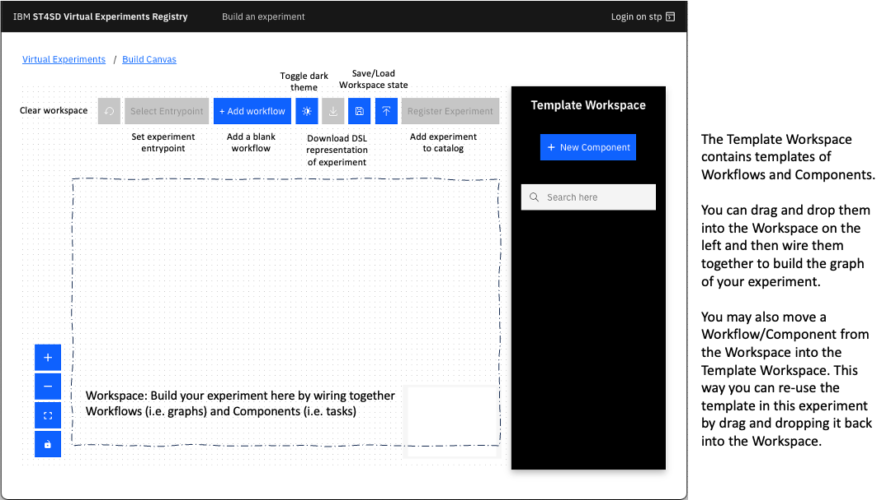

<!--

  Copyright IBM Inc. All Rights Reserved.
  SPDX-License-Identifier: Apache-2.0

-->

<PageDescription>

This page gives an overview of the functionality to build or modify experiments in a browser using the Build Canvas and Graph Library features of the ST4SD Virtual Experiments Registry UI.

</PageDescription>

<AnchorLinks>
  <AnchorLink>Create experiments via the Build Canvas</AnchorLink>
  <AnchorLink>The Graph Library</AnchorLink>
</AnchorLinks>

## Create experiments via the Build Canvas

The Build Canvas enables users to create new experiments and modify existing ones. With this feature, users can create Workflows and Components from scratch or reuse those that have already been saved in the Graph Library. When you first start using ST4SD, your Graph Library will be empty, but you can easily add to it as you create and save new experiments.

To access the Build Canvas, you have two options:

* To create a new experiment, click the "Build an experiment" link at the top left corner of the ST4SD Registry UI webpage.
* To modify an existing experiment, go to the main page of the experiment you want to modify and click the "Edit experiment" button.

The Build Canvas looks like this:



The Build Canvas is divided into two main sections:

### Workspace

The Template Workspace is the side panel on the right-hand side of the Build Canvas. It contains a library of Templates that users can drag and drop onto the Workspace area to speed up their experiment creation process. The Template Workspace acts as a temporary scratch space where users can have a list of Workflow and Component templates.

When users first open the Build Canvas, the Template Workspace on the left will be populated with items from the Graph Library. The entries in the side panel are organized as follows:

* Workflows (graph templates) are indicated by a green background.
* Components (individual task templates) have a white background.
* Entries with a `(*)` suffix indicate that they have not been saved to the Graph Library yet.

## Building the graph of an experiment

You can create the main Graph of your virtual experiment by nesting Components (individual tasks) and other Workflows (sub-graphs) inside a Workflow. Both Workflows and Components share a common interface, which consists of a signature with name and parameters and a set of implicit outputs.

The outputs of a Workflow are its nested steps, while the outputs of a Component are the paths that it generates when it executes. Since Workflows and Components have the same interface, we can use the term "Template" to refer to either of them.

A Template's parameters must receive a value, which can come from one of three sources:

1. The output of a different Component.
2. The value of a parameter of the parent Workflow.
3. If neither of the above, the default value of the template's parameter.

To nest a template inside a Workflow, simply drag and drop a template from either the Template Workspace side panel or the main Workspace onto the Workflow. Next, enter the name of the step that will execute the child template in the form that appears. Ensure that the name is unique among the children of the parent Workflow you selected.

Next, provide the values of the parameters for the child template. You have a few options for setting the parameters:

* Set parameters of the child template to literal values by editing the child template directly.
* Set the child parameters to parameters of the parent by connecting the parent's parameters to those of the child. To do this, drag the anchor at the bottom of the parent workflow inputs to the top anchor point of the child template. Then, assign values to the child parameters in the new form that appears.
* Configure the child step to consume outputs of its siblings. To do this, drag the bottom anchor point of a sibling step to the top anchor point of this child step. Then, assign values to the child parameters in the new form that appears.

The Build Canvas creates experiments that adhere to version 2.0 of the ST4SD Workflow Specification (i.e. DSL 2.0). You can find more information on DSL 2.0 at the [Workflow Specification 2.0 page](/workflow-specification-dsl).

Here are a few example videos that demonstrate how to use the Build Canvas:

<Tabs>

<Tab label="Hello world from scratch">

Simple hello world example:

<br/>

<Video src="../assets/videos/canvas/create-hello-world.mp4"></Video>

<br/>

The `hello-world` Workflow includes a parameter called `greetings` of type `executionOptions` that can be modified by users during the experiment launch. This parameter influences the message printed by the workflow's single component, which utilizes the `echo` command. The value of `greetings` is propagated from the parent workflow to the child component, determining the message that is printed.

</Tab>

<Tab label="Edit existing experiments">

You can edit the graph of experiments you create using the Build Canvas:

<br/>

<Video src="../assets/videos/canvas/edit-experiment.mp4"></Video>

<br/>

To modify an experiment, simply navigate to its page and click the "Edit experiment" button. This will allow you to use the Build Canvas to make changes to the experiment's graph. For example, in the "hello-world" experiment, we can add two "executionOption" variables: "greeting" and "name". The "greeting" variable can take on the values "hello" or "goodbye", while the "name" variable can be any string. With these changes, the updated "hello-world" experiment can now print "hello $name" or "goodbye $name".

</Tab>

<Tab label="Syntax check errors during building">

<br/>

Experiments undergo syntax checking **before** going into the experiment catalog:

<br/>

<Video src="../assets/videos/canvas/syntax-checks.mp4"></Video>

<br/>

When you click the "Register experiment" button, the runtime service will check the experiment for errors. If any errors are found, the service will reject the experiment and provide a list of errors that need to be fixed before it can be registered again. This list of errors can also be accessed while editing workflows and components, and you can re-run the validation logic to refresh the list of errors.

<br/>

When building graphs keep the following in mind:

<br/>

- The parameters of the entrypoint workflow must either be input files (indicated by names starting with `input.`) or have default values assigned to them.
- A step in a workflow can only use the parameters of that workflow or the outputs of other steps within the same workflow.
- Circular dependencies are not allowed.
- Each component must have an executable associated with it.

<br/>

You can find more information regarding DSL 2.0 at the [Workflow Specification 2.0 page](/workflow-specification-dsl).


</Tab>

<Tab label="Consume output of component">

Provide the path to the file `results.dat` that the `simulation` component produces to the `analysis` component:

<br/>

<Video src="../assets/videos/canvas/wire-components.mp4"></Video>

<br/>

The runtime will prefix the path `/results.dat` with the path to the working directory of `simulation`. Then it will apply the `:ref` method to produce the absolute path to the `results.dat` path. This is the value that will propagate to the `data` parameter of the `analysis` component.

</Tab>


<Tab label="Run a custom python script">

First containerize your python script and then use it in a component with the `kubernetes` backend:

<br/>

<Video src="../assets/videos/canvas/use-image.mp4"></Video>

<br/>

To containerize your python application you can follow the `How to use this image` tutorial of the `python` image that the Docker community maintains here: <https://hub.docker.com/_/python>. You may then upload the container to a Container registry that you have access.

<br/>

The above example uses the image `quay.io/ibmvassiliad/sum:latest`. The image consists of just 3 files:

<br/>

<details><summary>sum.py</summary>

```python
#!/usr/bin/env python

import numpy as np
import sys

# calculate the sum of N floats
print(np.sum([float(x) for x in sys.argv[1:]]))
```

</details>

<details><summary>requirements.txt</summary>

```
numpy==1.26.3
```

</details>

<details><summary>Dockerfile</summary>

```docker
FROM python:3.11-slim

RUN    apt-get update \
    && apt-get upgrade -y \
    && apt-get clean -y \
    && rm -rf /var/lib/apt/lists/*

# Make sure that files under /app are part of $PATH
ENV PATH=$PATH:/app
WORKDIR /app

COPY requirements.txt /app/requirements.txt

RUN pip install -r requirements.txt

COPY sum.py /app/sum.py

# Make the sum.py file executable
chmod +x /app/sum.py
```

<br/>

To build and push the container place all 3 files in the same directory and then in a terminal inside that directory execute:

<br/>

```
podman build --platform linux/amd64 -f Dockerfile -t <your registry>/sum:latest
podman push <your registry>/sum:latest
```

</details>

</Tab>

</Tabs>


## The Graph Library

The Graph Library is a collection of reusable Workflow recipes that the Build Canvas uses to populate the `Template Workspace` side-panel. New installations of ST4SD come with an empty library, and users can manage the library's contents via the Build Canvas.

The Graph Library has several properties:

* Each entry is a workflow, and if a user registers a Component template, the library automatically wraps it in a single-step Workflow container.
* Entries are identified by the name of their top-level workflow.
* Entries are immutable, meaning that to modify one, you must first delete it and then add a new graph with the same name.
* Entries are syntactically valid, and if a user attempts to add a Workflow/Component with errors, they will receive error messages listing the problems. The user must fix the errors before adding the template to the Graph Library.

Users can manage the Graph Library via the Template Workspace side-panel UI element of the Build Canvas. To access the Build Canvas, click the `Build experiment` button in the top left corner of the ST4SD Registry UI WebPage or the `Edit experiment` button in the main page of one of your experiments.

The Build Canvas starts by loading the Graph Library's contents and displaying them in the Template Workspace side-panel UI element. Users can move templates between the Workspace and the Template Workspace, as well as between the Template Workspace and the Graph Library. Entries that are in the Template Workspace but have not been stored in the Graph Library have a `(*)` suffix in their name.


The following videos demonstrate the core operations of the Graph Library:

<Tabs>

<!--
VV: Bug is currently preventing this from working

<Tab label="Glance at metadata of a Graph">

You can see the name, description, and parameters of a Graph.

<br/>

<br/>

To see the full implementation details (i.e. nested steps etc) of the Graph simply drag and drop the template from the Template Workspace into the Workspace.

</Tab>
-->

<Tab label="Use a Graph">

Simply drag and drop an entry of the Template Workspace into the Workspace:

<br/>

<Video src="../assets/videos/canvas/import-template.mp4"></Video>

<br/>

You can see the full implementation details of the imported template after you drag it from the Template Workspace into the Workspace. The template will then behave as if you had just created it from scratch. For example you can modify as part of editing the graph of your experiment.

</Tab>

<Tab label="Persist a new Graph">

You can store Graphs (Workflows and Components) in the Graph Library via the Template Workspace:

<br/>

<Video src="../assets/videos/canvas/persist-template.mp4"></Video>

<br/>

To add a Workflow or Component template to the Graph Library, start by locating the template in your Workspace. Double-click on the template to open a pop-up window, and then scroll to the bottom of the window to find the "Add to Template Workspace" button. Clicking this button will create an entry for the template in the Template Workspace. If the template is a Workflow, all of its nested children will be packaged into a single Graph and stored in the Graph Library.

<br/>

When you click the `Share` button you will notice a few changes taking place at the same time:

<br/>

* the suffix `(*)` in the entry's name will go away as the template is stored in the Graph Library
* if the template was a Component (i.e. it had a white background) it will automatically be wrapped inside a single-step Workflow (i.e. it will turn green)


</Tab>

<Tab label="Delete a Graph">

Double click on an entry in the Template Workspace and click the `Delete` button:

<br/>

<Video src="../assets/videos/canvas/delete-template.mp4"></Video>

<br/>

Note that this operation cannot be undone.

</Tab>

<Tab label="Modify a Graph">

Here is how to modify an existing Graph:

<br/>

<Video src="../assets/videos/canvas/modify-template.mp4"></Video>

<br/>

Notice that we drop the Graph into the Workspace so that we can modify it. Then we remove the entry from the Graph Library and edit the Graph (i.e. remove some parts of it). Finally, we just add it back into the Graph Library.

</Tab>


</Tabs>
