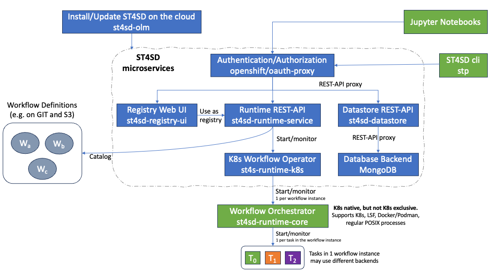

<!--

  Copyright IBM Inc. All Rights Reserved.
  SPDX-License-Identifier: Apache-2.0

-->

ST4SD is a cloud native, but not cloud exclusive, framework. When you [install the toolkit](/installation#install-on-kubernetes-and-openshift) on the cloud you deploy a collection of microservices. The microservices are acting as the proxy between the user and the [core runtime system](/orientation) of ST4SD.

<Column colMd={11} colLg={11} noGutterSm>

<ImageCard
  href="/"
  disabled
  aspectRatio="16:9"
  >

</ImageCard>

</Column>

Users interact with the microservices using [jupyter notebooks](/running-workflows-on-openshift) and the Command Line Interface (CLI) of ST4SD `stp`.

The definitions of virtual experiments live on a server for example a Git server or a Cloud Object Storage server like S3. The [Runtime REST-API](/running-workflows-on-openshift) and the [registry web ui](/using-the-virtual-experiments-registry-ui) contain pointers to the virtual experiment definitions which we term [Parameterised Virtual Experiment Packages](/creating-a-parameterised-package).

Users interact with the `Runtime REST-API` to run parameterised virtual experiments packages. The Runtime Service creates a `Workflow` CustomResource which triggers the `K8s Workflow Operator`. The K8s Workflow Operator creates a main pod that handles the orchestration of the virtual experiment instance using the `Workflow Orchestrator`. The Workflow Orchestrator may launch minion pods for the tasks of components in the virtual experiment that use the `kubernetes` backend of ST4SD.

Users can also run ST4SD on a machine that is not part of the cloud. For example, they may [install the Workflow Orchestrator](/installation#set-up-local-client) on the login node of a High Performance Cluster or their personal laptop. That will enable them to [execute virtual experiments](/tutorial#executing-sum-numbers) that use other backends of ST4SD, such as `lsf`, `docker`, and `local` (i.e. regular POSIX processes).
