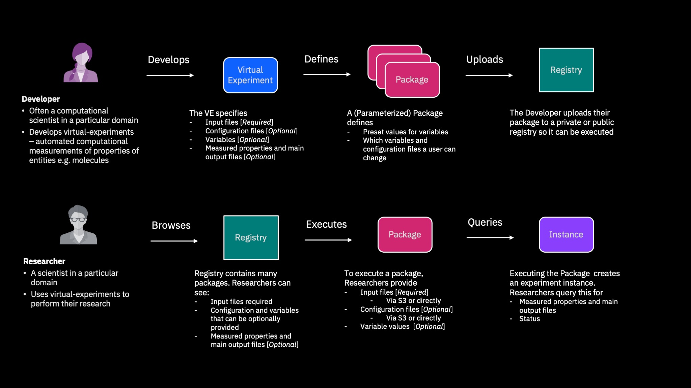

<!--

  Copyright IBM Inc. All Rights Reserved.
  SPDX-License-Identifier: Apache-2.0

-->

<PageDescription>

Use this page to learn about key ST4SD concepts and terminology.

</PageDescription>

<AnchorLinks>
  <AnchorLink>Terminology</AnchorLink>
  <AnchorLink>Virtual Experiment Inputs</AnchorLink>
  <AnchorLink>Virtual Experiment Outputs</AnchorLink>
</AnchorLinks>

## Overview      

<ImageCard
  href="/"
  title="How researchers and developers interact with ST4SD"
  aspectRatio="16:9"
  disabled
  >

</ImageCard>

## Terminology

* **Virtual Experiment**: A virtual experiment (sometimes shortened to _experiment_ or _VE_) is an application workflow which measures one or more characteristics of one or more input systems. Typically created by developers, they are defined by a configuration file and additional data they need to function e.g. scripts, configuration files.
* **Parameterised Virtual Experiment Package**: A Parameterised Virtual Experiment Package (also _parameterised package_ or _PVEP_) is a virtual experiment that has been pre-configured to perform a specific measurement. Researchers select and launch Parameterised Virtual Experiment Packages defined by Developers.
* **Virtual Experiment Instance**: A Virtual Experiment Instance (also _instance_ or _experiment instance_) is an execution of a particular virtual experiment, usually run via a PVEP.
* **Project**: A project is a directory structure used by developers to contain the definition of one or more virtual experiments. 
* **Direct Execution**: A Direct Execution refers to a virtual experiment run via the `elaunch.py` tool from the terminal of the machine the user is logged into e.g. a laptop or a HPC cluster.
* **REST API Execution**: A REST API Execution refers to a virtual experiment run on a (remote) Kubernetes/OpenShift cluster via the `st4sd-runtime-service` REST API (this is often is done via a Jupyter Notebook). 

## Virtual Experiment Inputs 

There are four ways to provide data to a virtual experiment. Only one - [inputs](#inputs) - is required. 

<AnchorLinks small>
  <AnchorLink>Inputs</AnchorLink>
  <AnchorLink>Data</AnchorLink>
  <AnchorLink>Variables</AnchorLink>
  <AnchorLink>Dependencies</AnchorLink>
</AnchorLinks>

### `inputs`

Inputs are files that the experiment **requires** to run. Usually they contain the information on what the experiment is measuring. 

<Tabs>

<Tab label="Researchers">

To find out what `inputs` an experiment requires check the experiment's documentation. 

#### REST API Execution 

When running using the REST APIs you provide the `input` files via the experiment payload. You can directly provide the content in the payload or provide a reference to an S3 bucket containing the files. 
     

​     

See [specifying experiment inputs](/running-workflows-on-openshift#specifying-experiment-inputs) and the [example notebooks](https://github.com/st4sd/st4sd-examples/)

#### Direct Execution 

When running directly `input` files are specified via the `-i` argument to `elaunch.py`

</Tab>

<Tab label="Developers">

`inputs` are any files you reference in your virtual experiment configuration using the directory `input/` e.g. `input/somefile:ref`.

​     

See [specifying input files](/tutorial#input-files) for more information.

​     

You can see these files by running `einputs.py` on your experiment. 

​     

</Tab>

</Tabs>

### `data`

`data` refers to configuration files that the experiment uses during runs. These can be optionally overridden but defaults always exist.

<Tabs>

<Tab label="Researchers">

#### REST API Execution 

You provide content for `data` files via the experiment payload. You can directly provide the content in the payload or provide a reference to an S3 bucket containing the files.  You can only do this for experiment packages whose parameterisation allows it.

​    

See [specifying experiment data](/running-workflows-on-openshift#specifying-experiment-data) and the [example notebooks](https://github.com/st4sd/st4sd-examples/)

#### Direct Execution

When running directly, you specify data files via the `-d` argument to `elaunch.py`

</Tab>

<Tab label="Developers">

`data` is any file you reference in your experiment using the directory `data/` e.g. `data/someconfigurationtemplate.txt:ref`.

​		

See [specifying data files](/tutorial#data-files) for more information.

​		

You can see these files by running `einputs.py` on your experiment.  

</Tab>

</Tabs>

### `variables`

`variables` are non-file parameters a virtual experiment defines. These can be optionally overridden but defaults always exist.

<Tabs>

<Tab label="Researchers">

#### REST API Execution 

You provide values for variables as part of the experiment payload. You can only do this for experiment packages whose parameterisation allows it.

​    

See [specifying experiment variables](/running-workflows-on-openshift#specifying-experiment-variables) and the [example notebooks](https://github.com/st4sd/st4sd-examples/)

#### Direct Execution

When running directly, you provide variables by supplying a correctly formatted YAML file to the `-a` argument to `elaunch.py`

</Tab>

<Tab label="Developers">

You define variables in the `variables` section of the experiment configuration. 

​		

See [specifying variables](/tutorial#variables) for more information.
Also see [variables](/workflow-specification#variables) for the specification syntax. 

​		

You can see the defined variables by running `einputs.py` on your experiment.  

</Tab>

</Tabs>

### `dependencies `

`dependencies` are external directories that the experiment requires to run c.f. `input` and `data` are files or archives

<Tabs>

<Tab label="Researchers">

#### REST API Execution 

You provide`dependencies` information via the experiment payload. The dependencies are passed by reference i.e. you give the location of the dependencies. 

​     

See [providing external directories to experiments](/packaging-workflows#providing-external-data-to-experiments) for details.  

#### Direct Execution 

When running directly, you specify dependencies using the `-s` option to `elaunch.py`.  

</Tab>

<Tab label="Developers">

`dependencies` are directories you reference in your experiment configuration that are listed under `application-dependencies` key. These directories are populated at runtime based either (a)  the manifest written for the experiment OR by (b) a user supplying one at runtime. 

​     

See [providing external directories to experiments](/packaging-workflows#providing-external-data-to-experiments) for details

</Tab>

</Tabs>

## Virtual Experiment Outputs

Virtual experiments can produce many output files of various sizes and importance.  

<AnchorLinks small>
  <AnchorLink>Key Outputs</AnchorLink>
  <AnchorLink>Properties</AnchorLink>
  <AnchorLink>Other Outputs</AnchorLink>
</AnchorLinks>

### Key Outputs

Key outputs are files/directories produced by the virtual experiment that the developer has identified as being of particular interest. Since the filenames may themselves be meaningless the developer gives them unique identifiers

<Tabs>

<Tab label="Researchers">

#### REST API Execution 

You can query and retrieve the key-outputs of a virtual experiment instance using the ST4SD API. 
See [Retrieving key-outputs](/running-workflows-on-openshift/#retrieving-key-outputs) for more details.

​    

**[Coming Soon]**: The key-outputs will be listed in Registry UI entry for each parameterized virtual experiment package based on the experiment. 

​    

You can instruct ST4SD to copy the key-outputs of an instance to an S3 bucket when the instance has finished. See [Automatically uploading key-outputs to S3](/running-workflows-on-openshift/#automatically-uploading-key-outputs-to-s3).

#### **Direct Execution **

Metadata describing key-outputs will be in the `output` directory in the top level of your experiment instance directory in the file `outputs.json` file. 

In addition, users may also request key-outputs be copied to an external location when an experiment instance finishes.
You can do this by setting the `--s3StoreToURI` and `--s3AuthWithEnvVars` (or `--s3AuthBearer64=S3AUTHBEARER64`) arguments to `elaunch.py`.

See the [documentation for direct runs](/direct-run) for more information.

</Tab>

<Tab label="Developers">

You define key-outputs in the ["output" section of the experiment configuration](/workflow-specification#key-outputs).

​    

ST4SD will record metadata about the key-outputs of your experiment instance, including their location and the timestamp they were last produced.

​    

In addition, users may also request key-outputs be copied to an external location when an experiment instance finishes. *Developers do not have to do anything to enable this.* 

</Tab>

</Tabs>

### Properties

When an experiment has a virtual experiment interface defined, property tables are also produced.

<Tabs>

<Tab label="Researchers">

#### REST API Execution 

You can see the properties provided by a parameterized virtual package by checking the experiment registry. You can access these properties using the ST4SD API. 

See [using virtual experiment interfaces](/using-a-virtual-experiment-interface) for more details. 

#### Direct Execution 

The property tables (csv files) defined by the interface are available at in the `output` folder in the top-level of the experiment instance directory in the file `properties.csv`

</Tab>

<Tab label="Developers">

You define the properties of your virtual experiment by defining a [virtual experiment interface](/writing-a-virtual-experiment-interface). 

</Tab>

</Tabs>

### Other Outputs

All other output files produced during an experiment run can be retrieved. 

<Tabs>

<Tab label="Researchers">

#### REST API Execution

You can [retrieve any output file](/running-workflows-on-openshift/#retrieving-outputs-via-the-st4sd-datastore-apis) of a virtual experiment instance using the ST4SD API

​     

If you have access to the cluster hosting the ST4SD you are using you can also [browse the outputs via a terminal](/running-ve-via-terminal/#examining-a-components-output-directory).

#### Direct Execution 

The experiment instance directory contains all the outputs of all steps and can be easily explored via the terminal. 

</Tab>

<Tab label="Developers">

All the outputs of an instance of a virtual experiment are available automatically via the ST4SD API. *Developers don't have to do anything to enable this.*

</Tab>

</Tabs>

