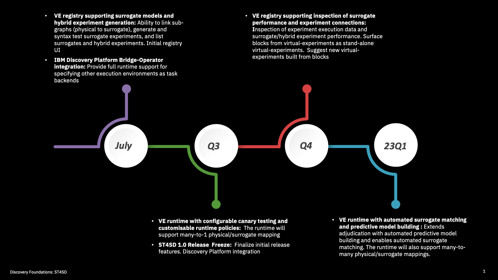

<!--

  Copyright IBM Inc. All Rights Reserved.
  SPDX-License-Identifier: Apache-2.0

-->

## Accelerating Surrogate Development

This year our main focus will be adding support to ST4SD to accelerate development of surrogate models - faster and less resource intensive AI based analogs to physical models. Many of these features focus on **adjudication support** - helping decide if a surrogate model should be used.

<Column colMd={11} colLg={11} noGutterSm>

<ImageCard
  href="/"
  disabled
  aspectRatio="16:9"
  >

</ImageCard>

</Column>

* **Canary Testing**: When you add a calculation using a surrogate-model ST4SD will automatically create surrogate versions for all virtual experiments using the corresponding physical calculation. It will then test them in the background and accumulate the results. This data can be used in **policies** (see below). The capability is enabled by our unique composition and memoization features. 
* **Automatic Linking**: Initially you will specify which physical-calculation (subgraph) a surrogate-calculation replaces. We are working on ways for ST4SD to infer this for itself. 
* **Configurable and User Policies**: Users will be able to supply custom functions which decide whether to replace a request  for a  physical virtual experiment with a surrogate, and if the surrogate result should be kept (or fall-back to physical virtual experiment). We will also provide some out-of-the-box configurable policies to get started.
* **Automatic Predictive Model Building:** This feature will help building models which predict if a surrogate should be used for a given input system. These can then be used in policy functions.  ST4SD will automatically create such models based on its canary testing (and other inputs) and provide them access to them in policy functions along with information on their accuracy. 

