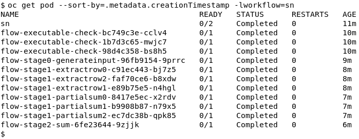

<!--

  Copyright IBM Inc. All Rights Reserved.
  SPDX-License-Identifier: Apache-2.0

-->

<PageDescription>

This page shows how to use the OpenShift CLI to interact ST4SD. 

</PageDescription>

<AnchorLinks>
  <AnchorLink>Software Requirements</AnchorLink>
  <AnchorLink>Basic Kubernetes Tasks</AnchorLink>
  <AnchorLink>Getting Started</AnchorLink>
  <AnchorLink>Running a Workflow</AnchorLink>
  <AnchorLink>Names and Labels</AnchorLink>
  <AnchorLink>Examining Virtual Experiments</AnchorLink>
  <AnchorLink>Debugging</AnchorLink>
  <AnchorLink>Switching from Notebook to Commandline</AnchorLink>
  <AnchorLink>Managing Workflows</AnchorLink>
</AnchorLinks>

iPython notebooks  make it easy to run and work with virtual experiments. However there is often a need to go deeper, especially for developers. In this case using the OpenShift CLI via a terminal is invaluable. 

<InlineNotification>

- **For**: Researchers, Developers and Administrators
- **Use-When:**
    - Researchers: You want to go deeper into the outputs of a particular workflow using standard terminal tools
    - Developers: Debugging virtual experiments. Inspecting and deleting workflows.
    - Administrators: Inspecting and deleting workflows.
- **Skill Requirements:**
    - Being comfortable with working with command-line technologies
    - Some knowledge of OpenShift/K8s CLI tools

   

</InlineNotification>


## Software Requirements

The basic requirements are:
* Access to an OpenShift instance with the ST4SD stack installed (see [first steps](/) for more information)
* OpenShift command line tools installed (`oc` and `kubectl`)


## Basic Kubernetes Tasks

### Accessing files on Kubernetes

By default, files created within Pods on a Kubernetes or OpenShift cluster are **ephemeral** - are lost once the Pod terminates. To persist files, you can mount a **Persistent Volume Claim (PVC)** to a path inside the Pod and write files to that location.

In ST4SD, any files generated by your virtual experiments are, by default, stored in the `workflow-instances` PVC within the namespace where ST4SD is deployed.

Transferring files into or out of your cluster is quite simple.
Create a Pod and use `kubectl cp` to copy files to/from a path inside the Pod.
If the Pod mounts a PVC, you can also use this method to access files stored in the volume.

- [Mount PVCs to Pods for persistent storage](https://kubernetes.io/docs/tasks/configure-pod-container/configure-persistent-volume-storage/#create-a-pod)
- [Copy files to/from Pods using kubectl cp](https://kubernetes.io/docs/reference/kubectl/generated/kubectl_cp/)


### Debugging Your Components

Components of your virtual experiments that use the kubernetes backend run as Pods within your cluster. The ST4SD experiment orchestrator also runs as a Pod and mounts the Persistent Volume Claim (PVC) containing your experiment files at the path `/tmp/workdir/`.


In general, you can debug Pods using the following techniques:

- [Open an interactive shell in a running Pod](https://kubernetes.io/docs/tasks/debug/debug-application/get-shell-running-container/)
- [Create a copy of a Pod for debugging](https://kubernetes.io/docs/tasks/debug/debug-application/debug-running-pod/#debugging-using-a-copy-of-the-pod)
- [General guidelines for debugging running Pods](https://kubernetes.io/docs/tasks/debug/debug-application/debug-running-pod/)


## Getting Started

### Terminology 

In the following we use 

- `component` to refer to a task/step in a workflow. 
- `workflow` to mean a particular encoding of a set of steps
- `workflow instance` to mean a particular execution of a `workflow`

### Logging-In to the Cluster

To run from a terminal you first need to login to the OpenShift cluster you want to run on. You can use user/password e.g.

```
oc login -u $USERNAME $CLUSTER
```

or copy the login command from the OpenShift console of the cluster you want to run in: 

1. Navigate to the console, login,
2. Click on your name in upper right corner  
3. Click `Copy Login Command`
4. Paste the copied command into the terminal and run it

## Running a Workflow

Running from a terminal involves two steps

1. Writing a short file in `YAML` that describes the workflow you want to run  
   - We call it ***`workflow.yaml`*** here but you can call it anything
2. Executing `oc apply -f workflow.yaml`

[Here](https://github.com/st4sd/st4sd-runtime-k8s/blob/main/examples/sum-numbers.yaml) is an example `yaml` for launching the `sum-numbers` toy workflow.  You can use this as a template for your writing your own workflow `yaml`. [This document](https://github.com/st4sd/st4sd-runtime-k8s/blob/main/docs/schema.md) gives a detailed description of all the available fields. 

You can also try running the `sum-numbers` workflow via this `yaml` 

```
oc apply -f docs/examples/sum-numbers.yaml
```

This currently assumes that various objects in the target ST4SD instance you want to run on have been named following the conventions outlined in the [ST4SD installation guide](/installation).  We hope to remove this requirement shortly.  

If the above works it will create a `workflow object` called `sn` - this is determined by the value of the `name` field in the workflow `yaml`. 

### I get st4sd.ibm.com/sn unchanged

This means someone already has run a workflow with the same name in the same instance of ST4SD. Execute

```
oc delete workflow sn
```

to remove the old version and try the `apply` command again. 

<InlineNotification>

The <b>oc delete</b> command <b>does not affect the files</b> that the workflow instance has already generated under the persistent volume storage. However, it does trigger the workflow instance, and any components that are still running, to terminate. It also deletes any Kubernetes objects that have been created by the workflow instance. See <a href="#querying-a-workflow-kubernetes-object">Querying a workflow kubernetes object</a> for more information on retrieving the status of a workflow via <b>oc</b>.

</InlineNotification>

## Names and Labels

Every kubernetes object has a name given by its `name` field. This name must be unique as it identifies a specific object. Here will refer to the name of a workflow as `WORKFLOW_NAME`

A kubernetes object can also have arbitrary `labels` associated with it. These are given as key-values under the `metadata.labels` section in a workflow's `yaml`. For example in the `sum-numbers.yaml` file we have:

```
metadata:
  labels:
    rest-uid: sn
    workflow: sn
  name: sn
```

`labels` are useful for **grouping** of objects as they allow you to list all objects with particular label key-value pair.

All labels defined in the workflows `yaml` are propagated to the pods the workflow creates. This allows us to find all pods created by a workflow instance, for example,  by asking for all pods who also have a label `workflow:sn`. In this document we call the value of the `workflow` field `WORKFLOW_ID`

From the example `yaml` above `WORKFLOW_NAME` and `WORKFLOW_ID` can be set independently. This is why we differentiate them. However **by convention** we assume they will be the same, as this makes life much easier!

## Examining Virtual Experiments

<AnchorLinks small>
  <AnchorLink>Querying a Workflow Kubernetes Object</AnchorLink>
  <AnchorLink>Examining a Components Logs</AnchorLink>
  <AnchorLink>Examining a Components Output Directory</AnchorLink>
</AnchorLinks>

### Querying a Workflow Kubernetes Object

Once you've started a workflow try the following commands

* `oc get workflows`
  *  Lists all workflows and displays their status (running, finished, failed, or an empty string for workflows which have not started running yet).
* `oc get workflow $WORKFLOW_NAME -o yaml` 
  * Returns the `yaml` of the workflow along with current status etc.
  * Example: `oc get workflow sn -o yaml`
* `oc describe workflow $WORKFLOW_NAME` 
  * This gives a similar, but shorter, output to `get`
  * **Importantly** it also returns the **EVENTS** associated with the created object - this is a primary way to [debug issues](#debugging-a-workflow-component).
* `oc get pods -l workflow=$WORKFLOW_ID `
  * Lists all the pods in the workflow
  * Example: `oc get pods -l workflow=sn`
  * The argument `-l` means `has this label key-value pair`

When you list the pods of a workflow instance you will see one that is also called `WORKFLOW_NAME` - this is the primary pod of the instance. Pods for other workflow components that use the Kubernetes backend are called `flow-$STAGE-$COMPONENT_NAME-$UNIQUEID`




### Examining a Components Logs

Getting the logs of a task is straight-forward:

* `oc logs POD_NAME` 
  * This outputs the logs of the container running in POD_NAME e.g. `oc logs flow-stage1-partialsum2-12290339-dc5vw`

### Examining a Components Output Directory

All components in a workflow write their output under a directory tree on the target cluster which you can login to and browse around with a terminal.  The key piece of information you need here is the `INSTANCE_NAME` of the executing instance of the workflow, which is also the name of the root of the directory tree. To get this run: 

```
oc describe workflow sn | grep instanceName
```

This will give output like:

```
instanceName: sum-numbers-2021-02-09T133047.732342.instance
```

`sum-numbers-2021-02-09T133047.732342.instance` is the `INSTANCE_DIR_NAME`

Then you can do:

* `oc exec $WORKFLOW_NAME -c elaunch-primary /bin/bash`
  *  Start a shell session in the primary pod of the workflow. From here you can `cd` to the directory at `$INSTANCE_DIR_NAME`. 
     * e.g you can run `cd /tmp/workdir/$INSTANCE_DIR_NAME`
  * The output of a workflow component called `COMPONENT_NAME` in stage X will be at `stages/stageX/COMPONENT_NAME`
  *  **This only works while the pod is executing** 
* `oc debug $WORKFLOW_NAME -c elaunch-primary` 
  *  Start a shell session in a copy of the primary pod of the workflow. From here you can browse to the workflow directory at `INSTANCE_DIR_NAME` like above
  * e.g you can run `cd /tmp/workdir/$INSTANCE_DIR_NAME`
  *  Tip: The default shell will be `sh`, however the primary pod also has `bash`
  *  **Use this if the pod has finished**
* `oc exec $WORKFLOW_NAME -c elaunch-primary -- einspect.py $INSTANCE_DIR_NAME`: 
  * Returns a detailed list of the state of the workflow components

## Debugging

<AnchorLinks small>
  <AnchorLink>Debugging a Workflow Component</AnchorLink>
  <AnchorLink>Debug Tools Available in the primary Pod</AnchorLink>
</AnchorLinks>

### Debugging a Workflow Component

Your first step in checking if there is an issue is to run `oc describe` e.g. `oc describe workflow WORKFLOW_NAME` or `oc describe pod WORKFLOW_NAME`. This allows you to check for example:

- If the pod was scheduled
- If the pods image was pulled
- Any issues with mounts
- If the pod went out-of-memory

If you want to debug deeper you can use

* `oc debug $PODNAME`
  * This starts a shell in a copy of `$PODNAME`.  Use this if you want to debug the image the pod was using. 
* `oc debug $WORKFLOW_NAME -c elaunch-primary` 
  * Start a shell in a copy of the primary pod of the workflow (same environment, mounts etc.)
  * As noted above you can browse to the workflow directory at `INSTANCE_NAME` however you also get access to three useful debug tools

### Debug Tools Available in the primary Pod

If you start a shell in the primary pod, via `exec` or `debug` you can run the following tools. First `cd` to the workflow instance directory at `INSTANCE_NAME`

- `ccommand.py`
  - This prints the command line for a component. 
  - Useful to check what was actually executed is what you thought it was
  - Example: `ccommand.py -s0 MyComponent`
- `einspect.py`
  - The prints the state of all the workflow components e.g. who failed, restarted etc. 
  - By default, it only prints components with issues
  - Example: `einspect -f all`
    - Prints status info on all components
- `cexecute.py`
  - Executes a component. In case of kubernetes use to reexecute any pod of any component. The same workdir will be used
  - Example: `cexecute.py -f -s0 MyComponent`
    - Note the `-f` causes a new pod to be spawned. If you don't specify it, ST4SD will try to execute `MyComponent` in the primary pod, which will usually fail due to necessary programs not being present.

## Switching from Notebook to Commandline

When you use the RESTApi via notebook to start a workflow it automates the creation of a workflow `yaml` as described above. Hence, you can still use the command line to work with it. 

However note the reverse is not fully true. If you launch from the terminal:

* you cannot use the start/stop/status functions in the notebook - the workflow is not registered with the RESTApi
* you *can* use the `st4sd-datastore` commands

To work with the command line all you need is to `REST UID` returned when you submitted the workflow from the notebook. This will be the `WORKFLOW_NAME` and the `WORKFLOW_ID` of the workflow instance.

## Managing Workflows

<AnchorLinks small>
  <AnchorLink>List and Sort</AnchorLink>
  <AnchorLink>Deleting</AnchorLink>
</AnchorLinks>

The number of Workflows and associated Job and Pod objects in a namespace can easily reach O(1000) and higher. 
This section describes how to examine, sort and delete these objects.

### List and Sort

By default `oc get wf` only lists workflows name and experiment state in alphabetical order of Name. However this can easily be customized

<InlineNotification>
This document assumes that there is only one kind of "Workflow" object on your cluster. If there are multiple CustomResourceDefinitions that introduce the Workflow object then you must use the full qualifier of the Workflow kind. Instead of "oc get wf" you should run "oc get wf.st4sd.ibm.com" (or the shorter form "oc get wc.st4sd").
</InlineNotification>

#### List workflows with custom-columns showing creation date, exit status and state

```
oc get wf --output custom-columns="NAME:metadata.name,AGE:metadata.creationTimestamp,EXIT-STATUS:status.exitstatus,STATE:status.experimentstate"
```

You can create a column for any data in the workflow objects YAML using the appropriate key-path.

#### Sort workflows by creation date

```
oc --sort-by=".metadata.creationTimestamp" get wf
```

Similarly you can sort workflow by any data in the workflow objects YAML using the appropriate key-path.

Combining the above you can list workflows showing creation data, exist-status and state sorted by date

```
oc --sort-by=".metadata.creationTimestamp" get wf --output custom-columns="NAME:metadata.name,AGE:metadata.creationTimestamp,EXIT-STATUS:status.exitstatus,STATE:status.experimentstate"
```

### Deleting

The following commands illustrate how you can delete workflow objects
This also deletes all Job and Pod objects associated with the workflow

<InlineNotification>

Deleting a Workflow object does not delete the data created by the workflow.
The output folder will still exist and the output is still accessible via the st4sd-datastore python API.

</InlineNotification>

<InlineNotification kind="warning">

Deleting the workflow object will delete it from st4sd-runtime-service: st4sd-runtime-service API
calls using the deleted workflows rest-uid will not work.

</InlineNotification>

<InlineNotification>

When deleting Workflows it's worth reviewing the meaning of experiment-state and exit-status [here](/running-workflows-on-openshift#getting-the-status-of-a-virtual-experiment-instance)

</InlineNotification>


#### Delete all workflows whose experiment-state is `finished`

```
oc get wf | awk '/finished/{print $1}' | xargs oc delete wf
```

#### Delete all workflows whose experiment-state is `failed`

```
oc get wf | awk '/failed/{print $1}' | xargs oc delete wf
```

#### Delete all workflows whose exist-status is failed

```
oc get wf --output custom-columns="NAME:metadata.name,EXIT-STATUS:status.exitstatus" | awk '/Failed/{print $1}' | xargs oc delete wf
```

#### Delete component Job and Pod objects associated with workflows whose experiment-state is `finished`

The oneliner below will not delete the Pod objects that contain the `elaunch-primary` container (i.e. the entrypoint Pod of the virtual experiment instance).
The code just deletes all Job and Pod objects that `elaunch-primary` created to run the tasks of components.
After running it, you will still be able to run `oc debug $WORKFLOW_NAME`.

```
oc get wf | awk '/finished/{print $1}' | xargs -n1 -I {} oc delete job -lworkflow={}
```

#### Delete all workflows whose name starts with `homolumo`

```
oc get wf | awk '/homolumo/{print $1}' | xargs oc delete wf
```

<InlineNotification kind="info">
Future versions of ST4SD will contain utilities to automate garbage collection of Kubernetes objects.
</InlineNotification>
