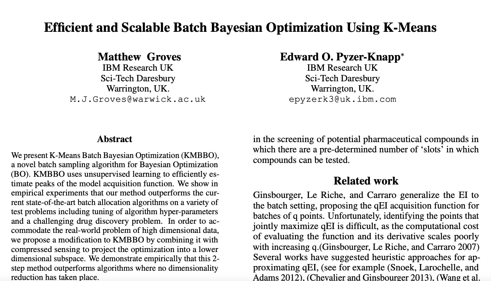
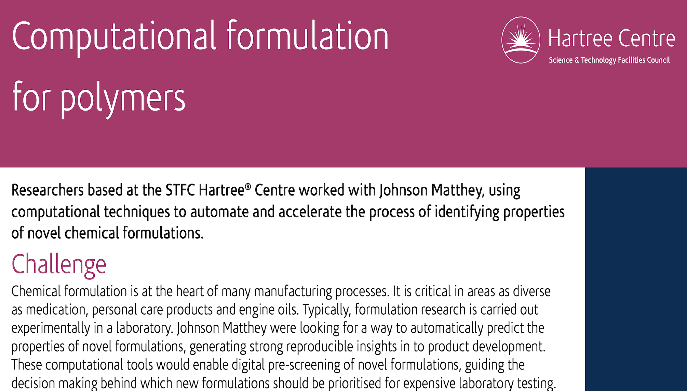

<!--

  Copyright IBM Inc. All Rights Reserved.
  SPDX-License-Identifier: Apache-2.0

-->

## Scientific Studies

A selection of scientific studies enabled by ST4SD

<Row className="resource-card-group">
<Column colMd={4} colLg={4} noGutterMdLeft>
  <ArticleCard
      subTitle="J. Phys. Chem. B"
      title="Model for the Simulation of the CnEm Nonionic Surfactant Family Derived from Recent Experimental Results"
      actionIcon="arrowRight"
      color="dark"
      href="http://dx.doi.org/10.1021/acs.jpcb.0c06132"
      >

  </ArticleCard>
</Column>

<Column colMd={4} colLg={4} noGutterMdLeft>
  <ArticleCard
      subTitle="JCTC"
      title="The Role of Chemical Heterogeneity in Surfactant Adsorption at Solid−Liquid Interfaces"
      actionIcon="arrowRight"
      color="dark"
      href="http://dx.doi.org/10.1021/acs.jctc.0c00759"
      >

  </ArticleCard>
</Column>

<Column colMd={4} colLg={4} noGutterMdLeft>
    <ArticleCard
      subTitle='SIAM News'
      title="Computational Topology in Geometric Design: Manifolds to Molecules"
      actionIcon="arrowRight"
      color="dark"
      href="https://sinews.siam.org/Details-Page/computational-topology-in-geometric-design-manifolds-to-molecules"
      >

  </ArticleCard>
</Column>

<Column colMd={4} colLg={4} noGutterMdLeft>
    <ArticleCard
      subTitle='JCTC'
      title="An Efficient Algorithm for Topological Characterisation of Worm-Like and Branched Micelle Structures from Simulations"
      actionIcon="arrowRight"
      color="dark"
      href="http://dx.doi.org/10.1021/acs.jctc.0c00311"
      >

  </ArticleCard>
</Column>

<Column colMd={4} colLg={4} noGutterMdLeft>
    <ArticleCard
      subTitle='Polymer International'
      title="What Can Digitization Do For Formulated Product Innovation and Development?"
      actionIcon="arrowRight"
      color="dark"
      href="http://dx.doi.org/10.1002/pi.6056"
      >

  </ArticleCard>
</Column>

<Column colMd={4} colLg={4} noGutterMdLeft>
    <ArticleCard
      subTitle="J. Phys. Chem. B"
      title="Toward a Standard Protocol for Micelle Simulation"
      actionIcon="arrowRight"
      color="dark"
      href="http://dx.doi.org/10.1021/acs.jpcb.6b03075"
      >

  </ArticleCard>
</Column>

<Column colMd={4} colLg={4} noGutterMdLeft>
    <ArticleCard
      subTitle="J. Phys. Chem. B"
      title="The Challenge to Reconcile Experimental Micellar Properties of the CnEm Nonionic Surfactant Family"
      actionIcon="arrowRight"
      color="dark"
      href="http://dx.doi.org/10.1021/acs.jpcb.8b11568"
      >

  </ArticleCard>
</Column>

<Column colMd={4} colLg={4} noGutterMdLeft>
    <ArticleCard
      title="Phase separation in ternary alcohol/water/hydrocarbin systems: Comparison of micro and meso scale methods"
      subTitle="In preparation"
      color="dark"
      href="javascript:void(0);"
      >

  </ArticleCard>
</Column>

<Column colMd={4} colLg={4} noGutterMdLeft>
    <ArticleCard
      title="Utilizing Machine Learning for Efficient Parameterization of Coarse Grained Molecular Force Fields"
      subTitle="J. Chem. Inf. Model"
      actionIcon="arrowRight"
      color="dark"
      href="https://pubs.acs.org/doi/abs/10.1021/acs.jcim.9b00646"
      >

  </ArticleCard>
</Column>

<Column colMd={4} colLg={4} noGutterMdLeft>
    <ArticleCard
      title="Bayesian optimization for accelerated drug discovery"
      subTitle="IBM J. Of Res. and Dev."
      actionIcon="arrowRight"
      color="dark"
      href="https://ieeexplore.ieee.org/abstract/document/8539993/"
      >

  </ArticleCard>
</Column>

<Column colMd={4} colLg={4} noGutterMdLeft>
    <ArticleCard
      title="Using Bayesian Optimization to Accelerate Virtual Screening for the Discovery of Therapeutics Appropriate for Repurposing for COVID-19"
      subTitle="Pre-Print"
      actionIcon="arrowRight"
      color="dark"
      href="https://arxiv.org/abs/2005.07121"
      >

  </ArticleCard>
</Column>

<Column colMd={4} colLg={4} noGutterMdLeft>
    <ArticleCard
      title="Accelerating computational discovery of porous solids through improved navigation of energy-structure-function maps"
      subTitle="J. Science Advances"
      actionIcon="arrowRight"
      color="dark"
      href="https://www.science.org/doi/full/10.1126/sciadv.abi4763"
      >

  </ArticleCard>
</Column>
</Row>

## ST4SD Technologies

Papers on technologies developed in ST4SD

<Row className="resource-card-group">

<Column colMd={4} colLg={4} noGutterMdLeft>
    <ArticleCard
      title="Fast, Transparent, and High-Fidelity Memoization Cache-Keys for Computational Workflows"
      subTitle="IEEE Services 2022"
      actionIcon="arrowRight"
      color="dark"
      href="https://ieeexplore.ieee.org/document/9860151"
      >

  </ArticleCard>
</Column>

<Column colMd={4} colLg={4} noGutterMdLeft>
    <ArticleCard
      title="Towards an Approximation-Aware Computational Workflow Framework for Accelerating Large-Scale Discovery Tasks"
      subTitle="ApPLIED 2022"
      actionIcon="arrowRight"
      color="dark"
      href="https://dl.acm.org/doi/10.1145/3524053.3542746"
      >

  </ArticleCard>
</Column>

<Column colMd={4} colLg={4} noGutterMdLeft>
    <ArticleCard
      title="Powerful, transferable representations for molecules through intelligent task selection in deep multitask networks"
      subTitle="J. Physical Chemistry Chemical Physics"
      actionIcon="arrowRight"
      color="dark"
      href="https://pubs.rsc.org/en/content/articlelanding/2020/cp/d0cp02319a/unauth"
      >

  </ArticleCard>
</Column>

<Column colMd={4} colLg={4} noGutterMdLeft>
    <ArticleCard
      title="Efficient and Scalable Batch Bayesian Optimization Using K-Means"
      subTitle="Pre-Print"
      actionIcon="arrowRight"
      color="dark"
      href="https://arxiv.org/abs/1806.01159"
      >

  </ArticleCard>
</Column>

<Column colMd={4} colLg={4} noGutterMdLeft>
    <ArticleCard
      title="Accelerating materials discovery using artificial intelligence, high performance computing and robotics"
      subTitle="npj Comp. Materials"
      actionIcon="arrowRight"
      color="dark"
      href="https://www.nature.com/articles/s41524-022-00765-z"
      >

  </ArticleCard>
</Column>

</Row>

## Case-Studies

<Row className="resource-card-group">
<Column colMd={4} colLg={4} noGutterMdLeft>
  <ArticleCard
      title="IBM Researchers develop easy-to-use virtual experiments for Unilever chemists"
      actionIcon="arrowRight"
      color="dark"
      href="https://www.ibm.com/blogs/research/2020/07/ibm-researchers-develop-easy-to-use-virtual-experiments-for-unilever-chemists/"
      >

  </ArticleCard>
</Column>

<Column colMd={4} colLg={4} noGutterMdLeft>
  <ArticleCard
      title="Virtual formulation of polymeric systems"
      actionIcon="arrowRight"
      color="dark"
      href="http://research.ibm.com/labs/uk/case-studies/pdf/Johnson_Matthey_CAF_Chemistry.pdf"
      >

  </ArticleCard>
</Column>

</Row>
