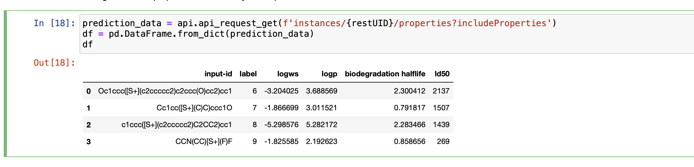

<!--

  Copyright IBM Inc. All Rights Reserved.
  SPDX-License-Identifier: Apache-2.0

-->

<PageDescription>

Learn how to use a virtual experiment interface

</PageDescription>

<AnchorLinks>
  <AnchorLink>Checking if a Virtual Experiment has an interface</AnchorLink>
  <AnchorLink>Accessing Interface Metadata</AnchorLink>
  <AnchorLink>Getting the Properties</AnchorLink>
  <AnchorLink>Handling errors</AnchorLink>
</AnchorLinks>

Some virtual experiments define interfaces which make it simpler for users to retrieve the input systems and measured properties from executions of that virtual experiment



## Checking if a Virtual Experiment has an interface

<AnchorLinks small>
  <AnchorLink>Check the global registry</AnchorLink>
  <AnchorLink>Check your local registry from a iPython notebook</AnchorLink>
  <AnchorLink>Check the return value of api_rest_uid_status</AnchorLink>
</AnchorLinks>

<InlineNotification>

Check the [accompanying python notebook](https://github.com/st4sd/st4sd-examples/blob/main/notebooks/ST4SD%20Runtime%20API%20Property%20Retrieval.ipynb) for examples of all the features and code described here .

</InlineNotification>

### Check the global registry

If you got the virtual experiment package from the [global registry](https://registry.st4sd.res.ibm.com/), go to the global registry entry and check if it has a *Virtual Experiment Interface* section.

### Check your local registry from a iPython notebook

If you know the id of the virtual experiment package execute the following - it will print `True` if the experiment has an `interface`.

```python
package = api.api_experiment_get('toxicity-prediction-nb')
if package['metadata']['registry']['interface']:
    print(True)
```

### Check the return value of `api_rest_uid_status`

If you've launched a run of a virtual experiment you can check runs status document to see if it has an interface. For example:

```python
status = api.api_rest_uid_status(rest_uid)
if status['experiment']['metadata']['registry']['interface']:
	print(True)
```

<InlineNotification>

The `status['experiment']` and `package` above have the same schema. The difference is that `status['experiment']` contains additional information that ST4SD discovers after it executes the instructions in the `package`. For example, the input-ids that the virtual experiment processed (in `experiment.metadata.registry.interface.inputs`).

</InlineNotification>

## Accessing Interface Metadata

When you run a virtual experiment with an `interface` there are two ways to retrieve it using the instances `rest_uid` - both return the same data.

The interface contains a description of the virtual experiment along with information on the inputs, the input spec and the names of the properties measured by the virtual experiment

#### Using the st4sd-runtime-service API

From the instances status `json` e.g.

```python
status = api.api_rest_uid_status(rest_uid)
print(status['experiment']['metadata']['registry']['interface'])
```

#### Using the st4sd-datastore API

From the instances experiment document e.g.

```python
exp_doc = api.cdb_get_document_experiment_for_rest_uid(
        rest_uid,
        include_properties=['*'])
print(exp_doc['interface'])
```

<InlineNotification>

The method `api.cdb_get_document_experiment_for_rest_uid()` raises an exception if the virtual experiment has not produced properties.

</InlineNotification>

## Getting the Inputs

The list of input system ids are available in the `status` and `experiment` documents by default

#### Using the st4sd-runtime-service API

The inputs are stored at `['experiment']['metadata']['registry']['interface']['inputs']` in the instances status `json`:

```python
print(status['experiment']['metadata']['registry']['interface']['inputs'])
```

#### Using the st4sd-datastore API

The inputs are stored at `['interface']['inputs']` in the instances experiment document e.g.

```python
print(exp_doc['interface']['inputs'])
```

## Getting the Properties

The property-table of a virtual experiment run can be obtained in a number of ways. In all cases the property-table is returned as a `dict` that can be used to instantiate a `pandas.DataFrame`.

#### Using the st4sd-runtime-service API

There are two options

##### Option One: With instance status

Add the `include_properties` keyword parameter to the `api_rest_uid_status` call. Its value should be one of

- `['*']` if you want all the properties
- A list of valid property-names (as defined in the interface) if you want a selection

The property table is then available at the key-path `status['experiment']['metadata']['registry']['interface']['propertyTable']` e.g.

```python
status = api.api_rest_uid_status(rest_uid, include_properties=['*'])
interface = status['experiment']['metadata']['registry']['interface']
df = pandas.DataFrame.from_dict(interface['propertyTable'])
df
```

##### Option Two: Direct REST-API call

You can make a direct request to get the full property table using the `instances/{restUID}/properties` route e.g.

```python
properties_dict = api.api_request_get(f'instances/{restUID}/properties')
df = pd.DataFrame.from_dict(properties_dict)
df
```

You can also select properties using `includeProperties` as a query parameter to the route e.g. `instances/{restUID}/properties?includeProperties=$VALUE`where $VALUE is a comma separated list of property names

```python
properties_dict  = api.api_request_get(f'instances/{restUID}/properties?includeProperties=logp')
df = pd.DataFrame.from_dict(properties_dict )
df
```

#### Using the st4sd-datastore API

Add the `include_properties` keyword parameter to the `cdb_get_document_experiment_for_rest_uid` call. Its value should one of

- `['*']` if you want all the properties
- A list of valid property-names (as defined in the interface) if you want a selection

The property table is then available at the key-path `exp_doc['interface']['propertyTable']` e.g.

```python
exp_doc = api.cdb_get_document_experiment_for_rest_uid(
        rest_uid,
        include_properties=['*'])
df = pandas.DataFrame.from_dict(exp_doc['interface']['propertyTable'])
df
```

## Handling Errors

<InlineNotification kind="warning"> Asking for properties before the experiment instance has produced them returns a HTTP status code 400. Asking for properties which do not exist returns a HTTP status code 404. </InlineNotification>

Below is an example of handling errors from requests for properties:

```python
import experiment.service.db.errors
import experiment.service.db
import pandas.DataFrame

# After the virtual experiment instance terminates
try:
    # Here we request all ('*') properties that the `rest_uid` instance measured
    status = api.api_rest_uid_status(rest_uid, include_properties=['*'])
    df: pandas.DataFrame = pandas.DataFrame.from_dict(
        status['experiment']['interface']['propertyTable'])
except experiment.errors.InvalidHttpRequest as e:
    print("Got invalid HTTP status code", e.response.status_code)
    error_info = e.response.json()
    if 'unknownRestUID' in error_info:
        print("There is no such rest-uid")
    elif 'propertiesNotAvailableYet' in error_info:
        print("Experiment has not produced properties yet - try again later")
    elif 'unknownProperties' in error_info):
        print(f"Experiment has no properties: {error_info['unknownProperties']}")
    else:
        print(f"Unknown HTTP problem {e}")
        raise
```
