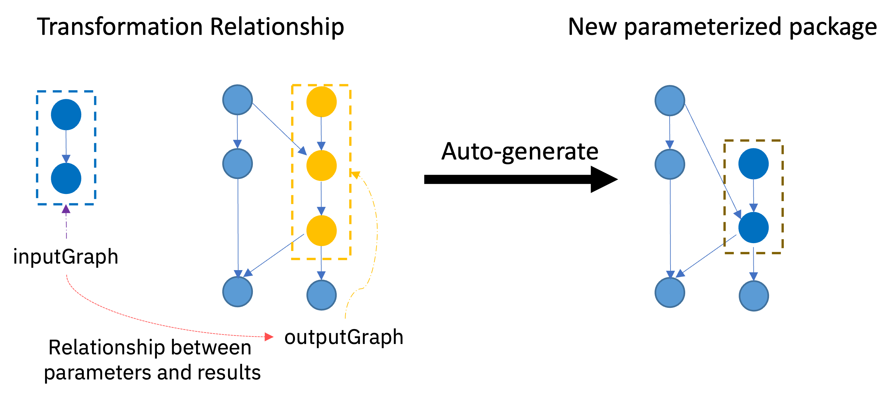

<!--

  Copyright IBM Inc. All Rights Reserved.
  SPDX-License-Identifier: Apache-2.0

-->

<PageDescription>

Use this page to learn how to use define relationships between virtual experiment graphs.

</PageDescription>

<AnchorLinks>
  <AnchorLink>What is a relationship?</AnchorLink>
  <AnchorLink>Structure of a relationship</AnchorLink>
  <AnchorLink>Pushing a relationship to the runtime</AnchorLink>
  <AnchorLink>Automatically synthesize new parameterised packages</AnchorLink>
</AnchorLinks>

## What is a relationship?

A core concept in ST4SD is the virtual experiment. A virtual experiment defines its execution logic in the form of a computational graph. This enables ST4SD to apply graph operations on the graphs of virtual experiments.

For example the runtime support of ST4SD for surrogate models performs a wide range of graph operations on the graphs of virtual experiments. It extracts sub-graphs from one or more virtual experiments, modifies them. Finally, it uses the transformed sub-graphs to update the graphs of different virtual experiment and even generate novel virtual experiments.


## Structure of a relationship

ST4SD currently features one type of relationship. The `transformation` relationship.

The transformation relationship defines how to:
1.  Use a parameter of `$outputGraph` (or a default value) for each parameter of `$inputGraph`.
2.  Map each `$outputGraph` result to a result of `$inputGraph` (or a default value).

The transformation relationship enables the runtime to:
1. Use `transform($inputGraph)` in the place of `$outputGraph` in any graph that contains `$outputGraph`.


The `schema` of the relationship transformation (in YAML) is:

```yaml
relationship:
  identifier: name of relationship
  transform: # there is currently only 1 type of relationship
    inputGraph: # required
      components: # required
      - component identifiers from graph that contains inputGraph
      # must set exactly 1 of identifier or source
      identifier: |
        the string identifier of an existing ParameterisedPackage
        This syntax sugar field is mutually exclusive with "source" field below
        When set, the runtime sets source to base.packages[0].source
        of the existing ParameterisedPackage
      source: # same schema as ParameterisedPackage.base.packages[idx].source
        git:
          location:
            url: https://url/to/clone
            # one of branch, tag, or commit
            branch: branch mane (mutually exclusive with tag and commit)
            tag: branch mane (mutually exclusive with branch and commit)
            commit: branch mane (mutually exclusive with branch and tag)
        dataset:
          location: dataset name
    outputGraph: identical to relationship.transform.inputGraph (required)
    relationship: # required
      inferParameters: true/false (default is true)
      inferResults: true/false (default is true)
      graphParameters: # Optional
      - inputGraphParameter:
          name: parameter name
        outputGraphParameter:
          name: parameter name
      graphResults: # Optional
      - inputGraphResult:
          name: DataReference
        outputGraphResult:
          name: DataReference

```

<InlineNotification kind="info">
The runtime inspects the graphs and how they are used to infer obvious mappings between parameters (if inferParameters is true) and results (if inferResults is true).
</InlineNotification>

The runtime validates the transformation relationships by testing that:

1. All inputGraph parameters have a relationship to an outputGraph parameter
1. All outputGraph results have a relationship to an inputGraph result

<InlineNotification kind="info">
In version 2.0.0 the "parameter" and "result" relationships will also be able to map a parameter/result to a default value.
</InlineNotification>


### Pushing a relationship to the runtime
You can submit a `relationship` to the ST4SD runtime-service API using the method `experiment.service.db.ExperimentRestAPI.api_relationship_push()`.


<InlineNotification kind="info">
The schema above is in YAML format. If you are using python (i.e. an instance of experiment.service.db.ExperimentRestAPI) you should either create an equivalent python dictionary OR a python string that contains the yaml definition and then convert the string into a dictionary using "yaml.loads(the_string)".
</InlineNotification>

#### Example: push a relationship


```python
from __future__ import typing
import json
def relationship_push(api: experiment.service.db.ExperimentRestAPI):
    """Creates a Transformation relationship between 2 parameterised
    packages from the ST4SD global registry

    Arguments:
      api: An instance of ExperimentRestAPI that has connected to your
           private ST4SD registry

    Notes:

      The method expects that you have already imported 2 parameterised
      packages from the ST4SD global registry into your private registry.
      The parameterised packages are: ::

        1. configuration-generator-ani (contains the inputGraph)
        2. band-gap-dft-gamess-us (contains the outputGraph)
    """

    relationship = {
      "identifier": "optimizedconfiguration-to-smilesinput",
      "transform": {
        "inputGraph": {
          "identifier": "configuration-generator-ani:latest",
          "components": [
            "stage0.GenerateOptimizedConfiguration"
          ]
        },
        "outputGraph": {
          "identifier": "band-gap-dft-gamess-us:latest",
          "components": [
            "stage0.SMILESToGAMESSInput"
          ]
        }
      }
    }

    relationship_fleshed_out = api.api_relationship_push(relationship)

    # The runtime system infers mappings between parameters and results
    print(json.dumps(relationship_fleshed_out, indent=2)
```

### Automatically synthesize new parameterised packages

You can use a `transformation` relationship to automatically synthesize a novel virtual parameterised virtual experiment package like so:


<Row>
  <Column colMd={8} colLg={8} noGutterSm>



  </Column>
</Row>

A user can trigger the runtime to synthesize a new parameterised package by submitting a `synthesis-from-transformation-relationship` payload to the runtime service using the method `experiment.service.db.ExperimentRestAPI.api_relationship_synthesize()`.

The structure (in `YAML`) of the payload is:

```yaml
parameterisation:
  presets:  # optional
    # Fields defined here *cannot* be overridden by `executionOptions`.
    # All fields are optional
    variables: #A list of preset values for variables in the virtual experiment
    - name: $name of variable
      value: $variableValue
    data:
      - name: name of a file in the "data" directory
        value: contents of file - utf8 string (not suitable for binary files)
    runtime:
      args:
      - array of `elaunch.py` command line strings
    platform:  #Value for the experiment platform.
  executionOptions: # optional
    # users may override values within constraints that workflow developers set
    variables:
    # Variables that the developer allows the user to override.
    # These CANNOT appear in presets.variables
    - name: $variable name
      valueFrom: #Optional: An array of possible values for the variable
      # If a user does set a value for the variable the 1st entry is used
      # If valueFrom is not given then user can set any value for the variable.
      # if they do not set any value then the variable
      # receives the value that the workflow definition contains in
      # the platform definition
      - value: value of variable
    data: #A list of data files whose contents the user can set.
    - name: filename under `data` directory, the file must already exist
    runtime: # Arguments to pass to `elaunch.py`
             # (cannot include -i -a -d --instanceName)
      args:
      - array of elaunch.py command line strings
    platform: #Default for experiment platform or choice.
              # Cannot be specified here if in `presets`
    - an array of platform names. # If the user does not specifying one on start
                                  # then the 1st entry is used. If no platform
                                  # is specified the `default` platform is used


```

<InlineNotification kind="info">
The "parameterisation" field is identical to the "parameterisation" field of parameterised packages. You can find more details about it in our [parameterised package documentation](/creating-a-parameterised-package#the-parameterisation-section).
</InlineNotification>


<InlineNotification kind="info">
The schema above is in YAML format. If you are using python (i.e. an instance of experiment.service.db.ExperimentRestAPI) you should either create an equivalent python dictionary OR a python string that contains the yaml definition and then convert the string into a dictionary using "yaml.loads(the_string)".
</InlineNotification>

Side effects of synthesis step:

1. The runtime service will create a novel parameterised package on the registry.
1. The new parameterised package:
   1. will contain all components from the virtual experiment that contains `outputGraph` except for those in the `outputGraph`. The runtime system will substitute those for the components of the transformed `inputGraph`.
   1. will have the parameterisation options specified in the `parameterisation` field of the schema above.
   1. inherits the [`interface`](/using-a-virtual-experiment-interface) of the virtual experiment that contains the `outputGraph`


### Example: use a transformation relationship to auto-generate a new parameterised package

```python
from __future__ import typing
import json
def relationship_synthesize(api: experiment.service.db.ExperimentRestAPI):
    """Uses a transformation relationship to synthesize a new parameterised
    package.

    Arguments:
      api: An instance of ExperimentRestAPI that has connected to your
           private ST4SD registry

    Notes:

      The method expects that you have already created the transformation
      relationship "optimizedconfiguration-to-smilesinput" in your
      ST4SD registry.
    """

    config = {
        "parameterisation": {
            "presets": {
                "platform": "openshift",
            },
            "executionOptions": {
                "runtime": {
                    "args": [
                        "--registerWorkflow=yes"
                    ]
                },
                "variables": [
                    {
                        "name": "n_conformers"
                    },
                    {
                        "name": "max_iterations"
                    }
                ]
            }
        }
    }

    synthetic_pvep = api.api_relationship_synthesize(
        # relationship identifier
        "optimizedconfiguration-to-smilesinput",
        config,
        # name of new PVEP
        "synthetic")
    print(json.dumps(synthetic_pvep, indent=2))
```
