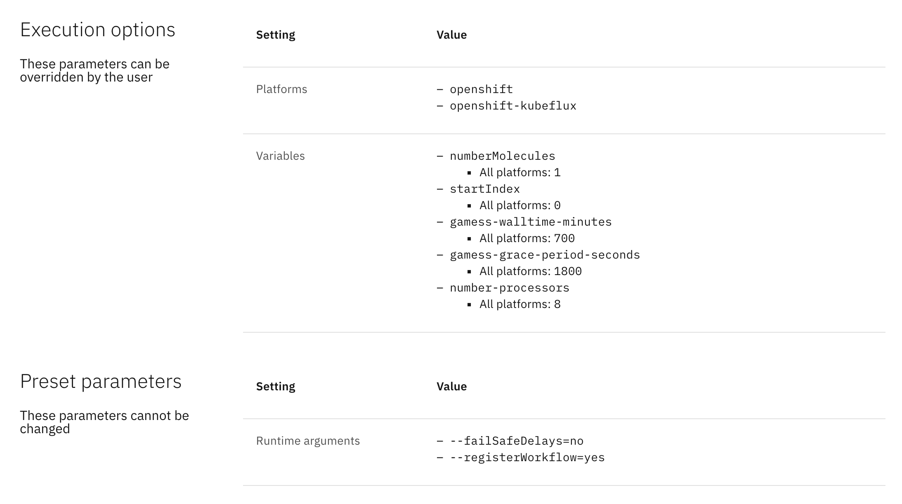
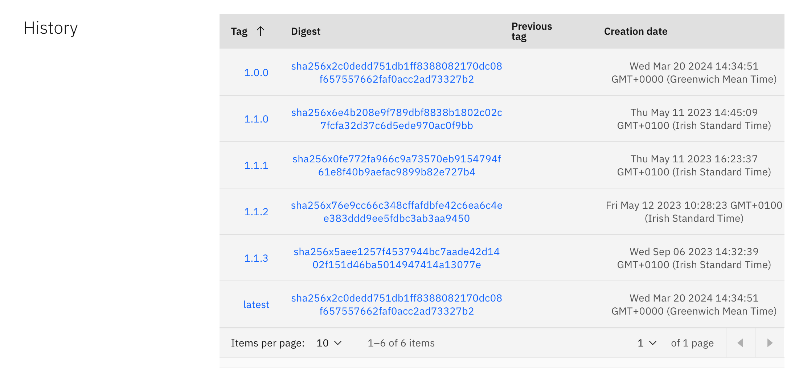
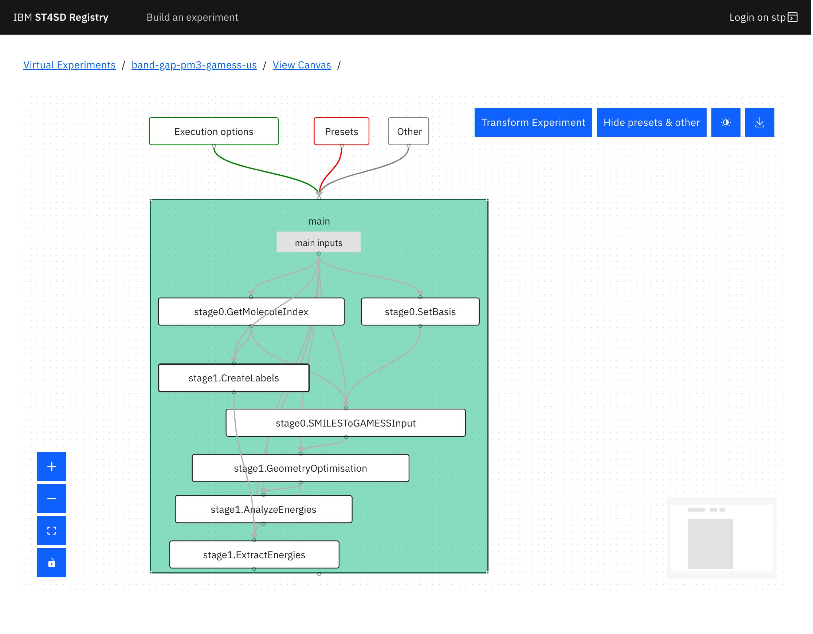
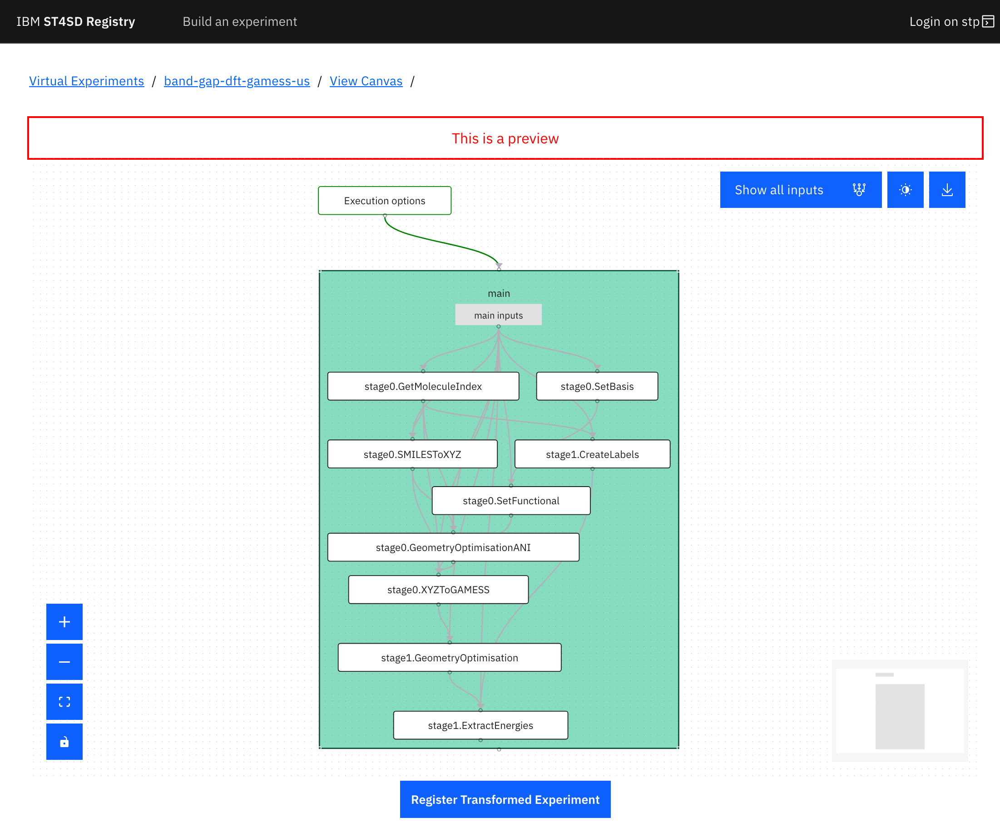

import { Tools } from "@carbon/pictograms-react";
import { Kubernetes } from "@carbon/pictograms-react";
import { ArtTools_01 } from "@carbon/pictograms-react";

<!--

  Copyright IBM Inc. All Rights Reserved.
  SPDX-License-Identifier: Apache-2.0

-->

<PageDescription>

This page gives an overview of the features provided by the ST4SD Virtual
Experiments Registry UI.

</PageDescription>

<AnchorLinks>
  <AnchorLink>The homepage</AnchorLink>
  <AnchorLink>The experiments page</AnchorLink>
  <AnchorLink>The View Graph page</AnchorLink>
  <AnchorLink>The Parameterisation Options page</AnchorLink>
  <AnchorLink>The View Runs page</AnchorLink>
</AnchorLinks>

## The homepage

The homepage of the Registry UI provides a user-friendly interface for browsing
and searching the available _parameterised virtual experiment packages_ (PVEPs),
virtual experiments that have been pre-configured to perform a specific
measurement. Refer to the [Terminology](/concepts#terminology) section to learn
more.

The search bar allows users to search PVEPs by name, description, maintainer, or
properties measured. Additionally, the filtering panel enables users to narrow
down their search results by domain, platform, and other criteria.

<InlineNotification>

Documentation for the "Build an experiment" functionality can be found
[here](/build-experiments-registry-ui).

</InlineNotification>

<Accordion>

  <AccordionItem title="View Screenshot">

  </AccordionItem>

</Accordion>

## The experiments page

<AnchorLinks small>
  <AnchorLink>Experiment specification</AnchorLink>
  <AnchorLink>Parameterisation</AnchorLink>
  <AnchorLink>Package information</AnchorLink>
</AnchorLinks>

When users click on one of the entries, they'll see three sections that provide
detailed information about the experiment.

### Experiment specification

The experiment specification section has three main objectives:

1. Providing easy access to the virtual experiment's interface, along with its
   description, properties, and input requirements.
2. Offering visual feedback on how well the experiment aligns with the
   [best practices](/virtual-experiment-developer-best-practices) for virtual
   experiments.
3. Providing quick links to view the experiment's graph, runs, along with
   editing and running functionalities.

To get the most out of the features provided by ST4SD, developers can click on
the progress indicator on the right to open a panel with helpful information.
The panel will provide guidance on how to improve their virtual experiments and
explain why each element is important.

To access more advanced features of the Registry UI, users can find a series of
links below the experiment description section. For more information about these
features, users can check out their respective sections, which contain more
in-depth explanations:

<AnchorLinks small>
  <AnchorLink>The View Graph page</AnchorLink>
  <AnchorLink>The Parameterisation Options page</AnchorLink>
  <AnchorLink>The View Runs page</AnchorLink>
</AnchorLinks>

<Accordion>

  <AccordionItem title="View Screenshot">

  </AccordionItem>

</Accordion>

### Parameterisation

This section shows the execution options and presets that make up the
parameterisation of the PVEP.

**Execution options** represent values that users can set at runtime to override
defaults. Depending on the parameterisation, users may be able to set arbitrary
values or only choose from a list of values set by the developer. **Presets**,
instead, are parameters that were set when the PVEP was
[added](/creating-a-parameterised-package) to the registry, and typically
represent. To modify these, a new version of the PVEP must be uploaded to the
registry.

<Accordion>

  <AccordionItem title="View Screenshot">

  </AccordionItem>

</Accordion>

### Package information

This section contains information about the internals of the parameterised
package, such as the list of base packages, container images used in the virtual
experiment, and developer-provided metadata. For virtual experiment definitions
hosted on GitHub, users also get the option to report problems by opening issues
that are pre-populated to include relevant information to help developers debug
the problem, such as the commit and branch/tag of the repository containing the
definition of this particular version of the virtual experiment.

<Accordion>

  <AccordionItem title="View Screenshot">

  </AccordionItem>

</Accordion>

The registry also displays all available revisions of the parameterised virtual
experiment package in the **History** section. The table includes
[current and previous tags](/creating-a-parameterised-package#package-tags), as
well as the creation date of each revision. Clicking on a digest will display
point-in-time data about that specific revision of the experiment, allowing
users to see how the parameterised virtual experiment package looked in the
past.

<Accordion>

  <AccordionItem title="View Screenshot">

  </AccordionItem>

</Accordion>

Users can easily download the experiment package entry or import it directly
into their own ST4SD Runtime Service instance using the button or Python code
provided at the bottom of the page.

<Accordion>

  <AccordionItem title="View Screenshot">

  </AccordionItem>

</Accordion>

## The View Graph page

The Registry UI allows users to visualize the compuational graphs that make up
virtual experiments. Users can click on items in the graph to see more
information, such as parameters, executable, and arguments. The download button
can be used to download the DSL that makes up the experiment. If
[relationships](/using-graph-relationships) have been defined for this
experiment, users can use the "Transform Experiment" button to preview and apply
them.

<Accordion>

  <AccordionItem title="View Screenshots">

<ImageGallery>
<ImageGalleryImage alt="View Graph UI" title="View Graph UI" col={4}>

</ImageGalleryImage>

<ImageGalleryImage  alt="View Graph UI details" title="View Graph UI details" col={4}>

</ImageGalleryImage>

<ImageGalleryImage  alt="View Graph Apply Transformation" title="View Graph Apply Transformation" col={4}>

</ImageGalleryImage>

</ImageGallery>

  </AccordionItem>

</Accordion>

## The Parameterisation Options page

In addition to the [parameterisation section](#parameterisation) of the
experiments page, the Registry UI also features a dedicated page in which users
can view and modify the parameterisation for platforms, variables, data files,
input files, and runtime options.

<Accordion>

  <AccordionItem title="View Screenshots">

<ImageGallery>
<ImageGalleryImage alt="View Parameterisation Options" title="View Parameterisation Options" col={4}>

</ImageGalleryImage>

<ImageGalleryImage alt="Edit Parameterisation Options" title="Edit Parameterisation Options" col={4}>

</ImageGalleryImage>

</ImageGallery>

  </AccordionItem>

</Accordion>

## The View Runs page

The Registry provides users with a convenient way to track their experiment runs
and view key information. At a glance, users can see the success rate of their
experiment campaigns for the selected time period. For more details, users can
refer to the table at the bottom of the page, which includes information such as
the state of the run, the PVEP revision and ST4SD version used, and the creation
date of the run. Additionally, users can click on the "Logs" entry for each run
to view the logs produced by ST4SD.

<Accordion>

  <AccordionItem title="View Screenshot">

  </AccordionItem>

</Accordion>

When the experiment incorporates a
[Virtual Experiment Interface](/writing-a-virtual-experiment-interface/), users
can explore all the properties measured in the experiment campaign by clicking
the "Compare Experiment Run Properties" link. Alongside a comprehensive table,
users are presented with line graphs and histograms displaying the measured
properties. The table's content can also be exported as a CSV file for further
analysis.

<Accordion>

  <AccordionItem title="View Screenshots">

<ImageGallery>
<ImageGalleryImage alt="Compare Experiment Run Properties table" title="Compare Experiment Run Properties table" col={4}>

</ImageGalleryImage>

<ImageGalleryImage alt="Compare Experiment Run Properties line chart" title="Compare Experiment Run Properties line chart" col={4}>

</ImageGalleryImage>

<ImageGalleryImage alt="Compare Experiment Run Properties histogram" title="Compare Experiment Run Properties histogram" col={4}>

</ImageGalleryImage>

</ImageGallery>

  </AccordionItem>

</Accordion>

In addition to viewing information about the experiment runs, users can also
click on the experiment identifiers (REST UIDs) to access the status and logs of
the components that make up the experiment. If the experiment includes a Virtual
Experiment Interface, users can also view and download the properties measured
by the experiment.

<Accordion>

  <AccordionItem title="View Screenshots">

<ImageGallery>
<ImageGalleryImage alt="Single run Components table" title="Single run Components table" col={4}>

</ImageGalleryImage>

<ImageGalleryImage alt="Single run Component log" title="Single run Component log" col={4}>

</ImageGalleryImage>

<ImageGalleryImage alt="Single run Properties table" title="Single run Properties table" col={4}>

</ImageGalleryImage>

</ImageGallery>

  </AccordionItem>

</Accordion>

## Learn more

  <ExpressiveList 
    title="Mastering stp"
    background="true"
    pictogram={<Tools />}>

Learn how to master [our command line tool](/stp), `stp`, for creating and
managing virtual experiment packages.

  </ExpressiveList>

  <ExpressiveList
    title="Installation"
    background="true"
    pictogram={<Kubernetes />}
    >

If you have access to an OpenShift cluster, follow our
[instructions](/installation#install-on-kubernetes-and-openshift) to install
ST4SD Cloud using <a href="https://olm.operatorframework.io/">OLM</a>.

  </ExpressiveList>

  <ExpressiveList
    title="Run experiments on your laptop"
    background="true"
    pictogram={<ArtTools_01 />}>

Don't have access to an ST4SD Registry or can't install it? You can test virtual
experiments on your laptop using our [command line tool](/direct-run).

  </ExpressiveList>

