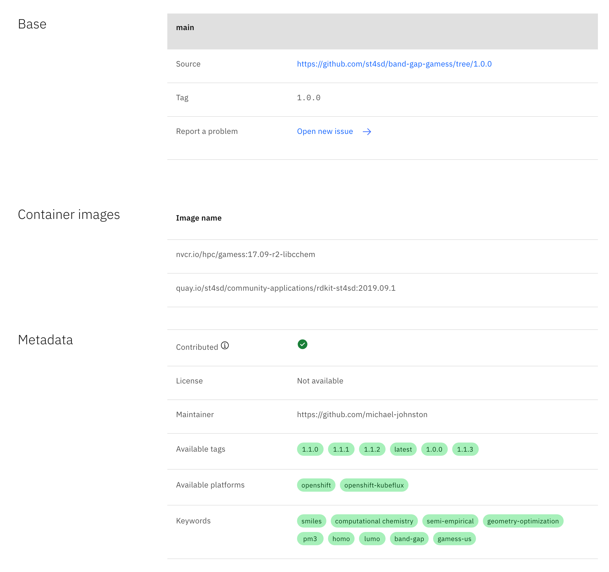

<!--

  Copyright IBM Inc. All Rights Reserved.
  SPDX-License-Identifier: Apache-2.0

-->

<PageDescription>

This page gives an overview of the ST4SD Virtual Experiments Registry UI.

</PageDescription>

<AnchorLinks>
  <AnchorLink>The homepage</AnchorLink>
  <AnchorLink>The experiments page</AnchorLink>
</AnchorLinks>

The ST4SD Registry UI is a web-based UI designed to provide information at a
glance about virtual experiments. You can watch a quick video walkthrough of the registry here:

<Video src="../assets/videos/using-the-virtual-experiments-registry-ui/ST4SD Global Registry Showcase.mp4"></Video>

## The homepage

The homepage of the Registry UI gives users an overview of the available
_parameterised virtual experiment packagess_. allowing them to filter the
results by domain, platform, or surrogate status, as shown in the screenshot
below:

<InlineNotification>

  Developers can find out more about creating parameterised virtual experiments
  packages [here](/creating-a-parameterised-package).

</InlineNotification>

## The experiments page

<AnchorLinks small>
  <AnchorLink>Experiment specification</AnchorLink>
  <AnchorLink>Parameterisation</AnchorLink>
  <AnchorLink>Package information</AnchorLink>
</AnchorLinks>

Upon clicking on one of the entries, users will be presented with three sections
containing detailed information about the experiment.

### Experiment specification

The first section serves two purposes: a) give immediate access to the interface
(description, measured properties, inputs, etc) of the virtual experiment, and
b) provide a visual feedback about how well the experiment adheres to
[best practices](/virtual-experiment-developer-best-practices).

Clicking the progress indicator on the right opens a panel where developers can
read how they can improve their virtual experiments to get the most out of the
features provided by ST4SD and why each element is important.

### Parameterisation

This section describes the available options to customize the execution of a
parameterisable virtual experiment package. Users may override variables,
runtime arguments, environment variables, and
[`platform`](/workflow-specification/#platforms) of the resulting virtual
experiment instance.

In the **Execution options** section, users can see what parameters they can
customize. Depending on the developer settings, users may specify an arbitrary
value for parameters, or choose between a list of choices. Finally, the **Preset
parameters** section, presents the parameters users cannot override. The
developers pre-configure these parameters when they
[push the parameterised package](/creating-a-parameterised-package) to the
registry.

### Package information

This section contains information about the internals of the parameterised
package, such as the list of base packages, container images used in the
virtual experiment, and developer-provided metadata. For virtual experiment
definitions hosted on Git, the users also get the option to report problems by
opening Github issues. The issues, automatically include relevant information to
help the developers debug the problem. For example, the commit and branch/tag of
the repository containing the definition of this particular version of the
virtual experiment.

The registry also displays all available revisions of the parameterised virtual
experiment package in the **History** section. The table includes the
current/previous tags, and the creation date of revisions. Clicking on a digest
opens a new page with point-in-time data about that specific revision of the
experiment, allowing users to see how the parameterised virtual experiment
package looked in the past.

Users can also quickly download the experiment package entry or import it
directly in their own ST4SD Runtime Service instance using the button or the
Python code provided at the bottom of the page.

