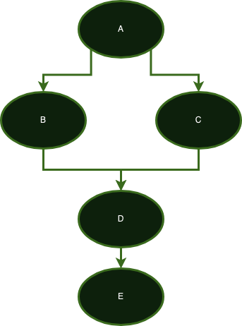
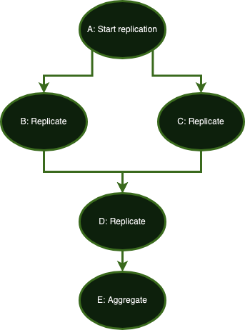

import { CarbonForIbmDotcom } from "@carbon/pictograms-react";
import { ArtTools_01 } from "@carbon/pictograms-react";

<!--

  Copyright IBM Inc. All Rights Reserved.
  SPDX-License-Identifier: Apache-2.0

-->

<PageDescription>

This page assumes you are familiar with running experiments locally using the elaunch.py command line tool. If you need a refresher take a moment to read our [docs](/direct-run) before continuing any further.

</PageDescription>


<InlineNotification kind="info">

Here, we are using DSL 2.0, if you need to understand the previous syntax check out the [FlowIR docs](/workflow-specification) and [FlowIR tutorial](/tutorial).

</InlineNotification>

<AnchorLinks>

  <AnchorLink>Requirements</AnchorLink>
  <AnchorLink>Hello world</AnchorLink>
  <AnchorLink>Your first multi-step experiment</AnchorLink>
  <AnchorLink>Working with input files</AnchorLink>
  <AnchorLink>Read a file that a different part of the experiment produced</AnchorLink>
  <AnchorLink>Replicate parts of your experiment</AnchorLink>
</AnchorLinks>


### Requirements

- An understanding of [how to run a ST4SD workflow locally](/direct-run).
- A python 3.9+ interpreter
- A virtual environment with the `st4sd-runtime-core` python module

    ```bash
    python -m venv venv
    . ./venv/bin/activate
    pip install "st4sd-runtime-core[develop]"
    ```
- A local copy of https://github.com/st4sd/st4sd-examples

    Clone the github repository and then cd into its sub-directory `tutorials/1-write-experiments`

    ```bash
    git clone https://github.com/st4sd/st4sd-examples.git
    ```


## ST4SD experiments

ST4SD experiments consist of 2 parts, the templates of the experiment and the entrypoint section which references the starting point. There are 2 types of templates: workflows and components.

A component describes how to execute a task. A workflow describes how to execute its children steps which they themselves can be instances of other workflows or components.

Let's see a couple of experiment examples.

<InlineNotification kind="info">

Make sure your working directory is the sub-directory `tutorials/1-write-experiments` of the directory you stored https://github.com/st4sd/st4sd-examples in.

</InlineNotification>

## Hello world


### The hello-world experiment

Below is a simple hello world experiment you can run. It prints a user configurable message:

```yaml
entrypoint:
  entry-instance: hello
  execute:
  - target: <entry-instance>
    args:
      message: Hello world

components:
- signature:
    name: hello
    parameters:
      - name: message
  command:
    executable: echo
    arguments: "%(message)s"
```

File: `0-hello-world.yaml`


Run it like so:

```commandline
elaunch.py -l40 --nostamp 0-hello-world.yaml
```


<InlineNotification kind="info">

For more information on running and troubleshooting experiments locally, check our [elaunch.py command line tool documentation](/direct-run).

</InlineNotification>

We use the `elaunch.py` script to execute a package, which happens to be a YAML file, and whose location is at `0-hello-world.yaml`. This happens to be a single-file package which we call `standard` project or package. There are also `directory` flavoured experiments which we call `standalone` packages. We'll use a `standalone` project in our next example, so for the time being let's focus on this `standard` project.

In ST4SD the outputs of an experiment are placed in a directory called `${package-name}.instance` which is created in the directory you were in when you ran `elaunch.py`.

For more information on the structure of `0-hello-world.instance` and how to run experiments using `elaunch.py` see our documentation on [running experiments locally](/direct-run/#what-is-the-output-of-my-experiment).

Before you continue any further, use `ls` and `cd` to look at the structure of `0-hello-world.instance` which contains the files related to this instance of your experiment. Make sure to look at the stdout of your component. You will find that file under `0-hello-world.instance/stages/stage0/entry-instance/out.stdout`.

You might be wondering why your `hello` component is called `entry-instance`. The next section explains why.

### Entrypoint

In this example, the `entrypoint` section looks like this:

```yaml
entrypoint:
  entry-instance: hello
  execute:
  - target: <entry-instance>
    args:
      message: Hello world
```

The purpose of the `entrypoint` is to reference the root template instance of your experiment and describe how to execute it by providing values to its parameters/arguments. This is similar to how in object oriented languages you create instances of classes. In ST4SD you use the entrypoint and workflows to execute component and workflow templates.

The entrypoint always points to exactly 1 instance of some template. This instance is always called `entry-instance`, kind of how you always have a `main` function in C and other languages. Because the `0-hello-world` experiment points to a component template, the instance of that component template is called `entry-instance`. You can find the files it produces under the directory `0-hello-world.instance/stages/stage0/entry-instance`.

Notice that in `entrypoint.execute[0].target` the entrypoint references `<entry-instance>` instead of `entry-instance`. This is to make it explicit that we are referencing an **instance** of a template, not the template itself. In ST4SD, references to template instances are enveloped in `<>` just like `<this>`.

### Components

The `components` array is where you define the component templates that your experiments may instantiate as steps. A component consists of a signature (i.e. unique name and parameters) and what it executes (i.e. its command). There are also other optional configurations which control its behaviour but we will omit these for now. If you wish to know more, there is a link at the bottom of this page with more information about the Domain Specific Language (DSL) that ST4SD experiments use.

Here is that component we saw above:

```yaml
signature:
  name: hello
  parameters:
  - name: message
command:
  executable: echo
  arguments: "%(message)s"
```

Focusing on the `command` dictionary we see that the command of this component points to the `echo` executable. You have 3 options when you define the executable of a command:

- The name of a binary which the runtime expects to exist in a directory that the `$PATH` environment variable points to (this example)
- An absolute path to the binary
- A path to the binary which relative to the instance directory. This last option is mostly useful when working with `standalone` projects which we cover in our next example.

`hello` is effectively a wrapper for the binary file `echo` which comes bundled with your typical Unix/MacOS/Linux operating system. When an instance of this component template runs it prints the contents of the `message` parameter to the stdout.

Speaking of parameters, notice that the `message` parameter does not have a default value. We could have added one like this:

```yaml
parameters:
  - name: message
    default: some default value
```

The `default` value of a parameter is only used if the caller of the component (in this example the `entrypoint`) does not assign a value to that parameter. In this instance, the entrypoint does assign a value to the `message` parameter so adding a default value will not make a difference.

### Exercises

In ST4SD you can override the parameters of `entry-instance` that the `entrypoint` sets via the dictionary `entrypoint.execute[0].args`.

For example, place the following into a new file `my-variables.yaml`:

```yaml
global:
  message: my custom message
```

Then remove the `0-hello-world.instance` directory and run the experiment again but this time use load the `my-variables.yaml` file:

```bash
: # Recall that you have to remove 0-hello-world.instance because of --nostamp
rm -rf 0-hello-world.instance
elaunch.py -l40 --nostamp -a my-variables.yaml 0-hello-world.yaml
```

Take a look at the stdout of your component. If you are having trouble finding the output under the `0-hello-world.instance/stages` directory see our documentation on [running experiments locally](/direct-run/#what-is-the-output-of-my-experiment). The path to the file that contains the stdout of the component `hello` is `0-hello-world.instance/stages/stage0/entry-instance/out.stdout`.


## Run some custom python code

What if you wanted to execute a custom python script with your component? You'd just need to point your `command.executable` to a python script.

Here's an example script:

```python
#!/usr/bin/env python

import sys

print(sys.argv[1])
```

File: `1-hello-python.package/bin/hello.py`


<InlineNotification kind="info">

Make sure that files you use for `command.executable` are actually "executable"! In this example, we've already run `chmod +x 1-hello-python.package/bin/hello.py` for you.

</InlineNotification>

Your experiment definition would look like this:

```yaml
entrypoint:
  entry-instance: hello
  execute:
  - target: <entry-instance>
    args:
      message: Hello world

components:
- signature:
    name: hello
    parameters:
      - name: message
  command:
    executable: bin/hello.py
    arguments: '"%(message)s"'
```

File: `1-hello-python.package/conf/dsl.yaml`

Eagle eye readers will have noticed that the path to the DSL file is now `1-hello-python.package/conf/dsl.yaml`. Contrary to the `0-hello-world.yaml` experiment above this new experiment is not a "single file" experiment (i.e. a `standard` project). It is what we call a `standalone` project. A standalone project is a directory which contains the experiment configuration file under the `conf` sub-directory. It may also contain other sub-directories which it can reference. For example, it is common for standalone projects to contain  the script(s) they're using under the `bin` directory.

When you looked at the contents of the `0-hello-world.instance` directory for the above example you actually saw some of these directories. This is because a "standard" project is just a compressed form of a "standalone" project. Before `elaunch.py` starts executing your experiment it populates the contents of the experiment instance directory by copying over the contents of the project in the form of a `standalone` project. This gets you the `conf`, `data`, and other directories that we went over in our [outputs of experiments](/direct-run#what-is-the-output-of-my-experiment) docs.

<InlineNotification kind="info">

ST4SD supports a couple of different ways to write experiments. It determines which format to use for loading the experiment by looking at the filename of the experiment configuration. When building experiments using the DSL you see in these examples make sure to store your experiment configuration file as `$package_name/conf/dsl.yam`. For more information see our documentation on [packaging workflows](/packaging-workflows).

</InlineNotification>

Let's take a closer look at the `command` field of the `hello` component:

```yaml
command:
  executable: bin/hello.py
  arguments: '"%(message)s"'
```

The executable is `bin/hello.py`. This is a relative path (it does not start with a `/` but contains a `/`) which instructs the runtime that it should find the binary that `command.executable` points to under the experiment instance directory.


### Exercises

- Use `elaunch.py` to run `1-hello-python.package` and look at the output of the component. Recall that `elaunch.py` expects a path to the package definition. Which in this example is `1-hello-python.package/`. After `elaunch.py` completes, look at the stdout of your component.

## Your first multi-step experiment

Running multiple steps requires chaining components. That's where Workflow come in.

Here's an example:

```yaml
entrypoint:
  entry-instance: many-steps
  execute:
  - target: <entry-instance>
    args:
      external: From entrypoint arguments

workflows:
- signature:
    name: many-steps
    parameters:
    - name: external
  steps:
    foo: hello
    bar: hello
  execute:
    - target: <foo>
      args:
        message: "from my parent workflow: %(external)s"
    - target: <bar>
      args:
        message: "from my producer: <foo>:output"

components:
- signature:
    name: hello
    parameters:
      - name: message
  command:
    executable: echo
    arguments: "%(message)s"
```

File: `2-many-steps.yaml`

### Workflows

A workflow looks similar to the `entrypoint` doesn't it? That's by design.

The `entrypoint` is just a special `workflow`  which executes exactly 1 `step` called `entry-instance` so it has exactly 1 entry under its `execute` array. In contrast, `workflow` templates describe how to execute 1 or more steps.

Let's dig into the `many-steps` workflow:

```yaml
signature:
  name: many-steps
  parameters:
    - name: external
steps:
  foo: hello
  bar: hello
execute:
- target: <foo>
    args:
        message: "from my parent workflow: %(external)s"
- target: <bar>
    args:
        message: "from my producer: <foo>:output"
```

It has a `signature` with a name and parameters, just like the `hello` component. However, unlike the `component` kind of Templates, the `workflow` Templates do not have a `command` section or any of the other `component` sections. Instead they have a `steps` and an `execute` section.

The `steps` section assigns identifiers to the template instances that the workflow creates. We call these identifiers `step identifiers`. The `execute` section describes how to execute the `steps`. For each step of the workflow, the execute array contains an entry with a `target` field that referencing a step like `<this>`. It also contains an `args` and dictionary for providing values to the parameters of the `target` step.

Earlier we saw how components reference their parameters (e.g. in their commandline). Workflows can reference their own parameters to set the values of arguments to their `steps`. Here's how this workflow sets the  `message` parameter of its `<foo>` step:

```yaml
- target: <foo>
    args:
        message: "from my parent workflow: %(external)s"
```

Workflow steps can also reference the outputs of other steps. Let's take a look at `<bar>`:

```yaml
- target: <bar>
    args:
    message: "from my producer: <bar>:output"
```

See how it references the `<foo>` step? It actually uses the `:output` output of the `<foo>` step which instructs the ST4SD runtime to replace the `<foo>:output` string with the contents of the contents of the `stdout` stream from the `<foo>` step. Referencing steps in the arguments of other steps also defines the execution order of the steps. There are other reference methods, like for example `:ref` which you can use to reference a file or a directory that a component produces. We have a link to the DataReference documentation at the bottom of this document.

In this example, the runtime system will execute the `<foo>` component first because it needs its output before it can launch the `<bar>` component.


### Exercises

- Run the experiment and take a moment to think what the contents of the file out.stdout of `<bar>` should be.  Next, look at the directories under `stages/stage0` and read the `out.stdout` file for the `<bar>` component.
- Add a third step to the workflow which references the `:output` of both `foo` and `bar`.

## Working with input files

Let's build an experiment which uses python to read a file and print its contents to the terminal.

```yaml
entrypoint:
  entry-instance: wrapper
  execute:
  - target: <entry-instance>
    args:
      input.message: input/message

workflows:
- signature:
    name: wrapper
    parameters:
      - name: input.message

  steps:
    printer: printer
  execute:
    - target: <printer>
      args:
        file: "%(input.message)s:ref"

components:
- signature:
    name: printer
    parameters:
      - name: file
  command:
    executable: cat
    arguments: "%(file)s"
```

File: `3-input-files.yaml`


The `printer` component has a `file` parameter. When the `wrapper` workflow instanciates the `<printer>` step it sets the value of its parameter `file` to `%(input.message)%s:ref`. This instructs the runtime that the `<printer>` is receiving a reference `(:ref)` to a file whose path is `%(input.message)s` i.e. `input/message`.

To run this experiment create a file called `message` with a message like this:

```
A greeting read from a file
```

Then launch the experiment like so:

```
elaunch.py -l40 --no-stamp -i message 3-input-files.yaml
```


The `-i message` argument instructs the runtime that it should use the `message` file as an `input` file for your experiment. It'll place that file under the directory `3-input-files.instance/input` which will enable instances of components and workflows to reference it by including the text `input/message:$method` in their arguments. Where `method` can be one of [`output`, `ref`, `copy`, `link`]. The whole string `$path:$method` (in this example `input/message:ref` ) is what we call a DataReference in ST4SD. You can find more information about DataReferences in our [workflow specification documentation](/workflow-specification#datareference).


### Exercises

- Execute the `3-input-files.yaml` experiment using `elaunch.py` and then look at the output of the `printer` component in `stage0`.


## Read a file that a different part of the experiment produced

In ST4SD workflow and component templates have `outputs` which steps can reference. The outputs of `workflows` are its children `steps` and the outputs of a `component` are the file(s) it produces as well as the text it prints to its stdout stream.

We already saw an example of this in [`Your first multi-step experiment`](#your-first-multi-step-experiment) where a component printed the `stdout` of a different component. Let's take it a step further and have an experiment where a component prepares a file that a different component reads.


```yaml
entrypoint:
  entry-instance: many-steps
  execute:
  - target: <entry-instance>
    args:
      external: From entrypoint arguments

workflows:
- signature:
    name: many-steps
    parameters:
    - name: external
  steps:
    foo: writer
    bar: reader
  execute:
    - target: <foo>
      args:
        message: "%(external)s"
    - target: <bar>
      args:
        file: "<foo>/my_output.txt:ref"

components:
- signature:
    name: writer
    parameters:
      - name: message
      - name: output_file
        default: my_output.txt
  command:
    executable: echo
    arguments: "%(message)s > %(output_file)s"

- signature:
    name: reader
    parameters:
      - name: file
  command:
    executable: cat
    arguments: "%(file)s"
```

File: `4-read-step-outputs.yaml`

Here's how we configure the `bar` step to consume the file `my_output.txt` that the `foo` component produces:


```yaml
execute:
  # ...
  - target: <bar>
    args:
      file: "<foo>/my_output.txt:ref"
```

The parent workflow configures the value of the `file` parameter that the `bar` step has to: `<foo>/my_output.txt:ref`. This represents `a file reference (:ref) to the "my_output.txt" output that the <foo> step produces`.

## Exercises

- Run the experiment and look at the files that component instances produced.

## Replicate parts of your experiment

Sometimes you just need to run several copies of the same task on different data.

Take for example the graph below:

<Column colMd={4} colLg={4} noGutterSm>

<ImageCard
  href="/"
  disabled
  >


</ImageCard>

</Column>


The component `A` access a database and produces some output which the components `B` and `C` read. The component `D` then reads the outputs of of `B` and `C`. Finally, component `E` processes the output of `D`. Databases typically hold more than just a single item and manually unrolling graphs to match the number of input items is tedious and error prone.

ST4SD supports simple markets to indicate when the graph unrolling begins and ends. We call these markets `replication` and `aggregation` markers. Let's imagine that components `A`, `B`, `C`, and `D` should execute once per input item but the `E` component should execute just once to aggregate the results of all the replicas of the `D` component.

You can write a ST4SD experiment in which:

- the `A` component contains a configuration option which `replicates` the sub-graph that starts from `A`.
- the `E` component contains a configuration option which `aggregates` the sub-graph(s) that feed their outputs to `E`.

ST4SD will automatically configure the components between `[A, E)` to `replicate` for as many times as the `A` component replicates. Notice that the components include `A` (start of replication) but exclude `E` (aggregating node). The runtime modifies the aggregating component `E` so that any parameters it receives to any of the replicated components are rewritten such that they point to *all* replicated components. The annotated graph with the replicate/aggregate markers looks like this:

<Column colMd={4} colLg={4} noGutterSm>

<ImageCard
  href="/"
  disabled
  >


</ImageCard>

</Column>

When executing the experiment and setting `A` to replicate 2 times you get this unrolled graph:

<Column colMd={11} colLg={11} noGutterSm>

<ImageCard
  href="/"
  disabled
  aspectRatio="16:9"
  >


</ImageCard>

</Column>

There are now 2 `replicas` of each of the components `A`, `B`, `C`, and `D`. Each of the replicas has a suffix indicating its `replica id`.

Let's build a simple experiment which contains replicating components. It has `N` components that produce 1 file each containing 1 pair of integers. There are `N` components to process each of those pairs and calculate the sum of the numbers in the file. A final component consumes the `N` sums and prints their product.

```yaml
entrypoint:
  entry-instance: product-of-sums
  execute:
    - target: <entry-instance>
      args:
        N: 3
workflows:
- signature:
    name: product-of-sums
    parameters:
      - name: N
        default: 1
  steps:
    generate-random-pairs: generate-random-pairs
    sum: sum
    calculate-product: calculate-product
  execute:
    - target: <generate-random-pairs>
      args:
        number_pairs: "%(N)s"
    - target: <sum>
      args:
        file: <generate-random-pairs>/pair.yaml:ref
    - target: <calculate-product>
      args:
        numbers: <sum>:output

components:
- signature:
    name: generate-random-pairs
    parameters:
      - name: number_pairs
      - name: output_file
        default: pair.yaml
      - name: random_seed
        default: 42
      - name: value_min
        default: 1
      - name: value_max
        default: 10
  workflowAttributes:
    replicate: "%(number_pairs)s"
  command:
    executable: bin/generate_input.py
    arguments: "%(random_seed)s %(value_min)s %(value_max)s %(output_file)s"

- signature:
    name: sum
    parameters:
      - name: file
  command:
    executable: bin/sum.py
    arguments: "%(file)s %(replica)s"

- signature:
    name: calculate-product
    parameters:
      - name: numbers
  workflowAttributes:
    aggregate: true
  command:
    executable: bin/product.py
    arguments: "%(numbers)s"
```

File: `5-replication.package/conf/dsl.yaml`

### Replication and Aggregation

The `generate-random-pairs` component contains a `workflowAttributes.replicate` field whose value is `%(number_pairs)s`. When the value of that field is greater than 0 the runtime replicates the sub-graph for as many times as the value of this field. The replicated sub-graph starts from that node till it either reaches a component containing the field `workflowAttributes.aggregate=true` (excluding the aggregating component) or a leaf-component (including the leaf component).

The name of a component's replica starts with the name of the component and ends with the index of the replica.

In this experiment, `generate-random-pairs` and `sum` components to replicate for `3` times. The 3 replicas of the `sum` component are `sum0`, `sum1`, and `sum2`.

The runtime system also automatically injects a parameter to replicated components called `replica`. It holds the `replica id` of that component.

Here's how that component looks like:

```yaml
- signature:
    name: sum
    parameters:
      - name: file
  command:
    executable: bin/sum.py
     # the replica parameter is auto injected, it does not appear
     # in the signature of this component
    arguments: "%(file)s %(replica)s"
```

When an aggregating component has a parameter whose value points to a replicating component, the runtime system automatically rewrites the value in way that it "aggregates" that specific output of all the referenced replicated components.

In this example, the parameter `numbers` of `calculate-product` starts with a value of `<sum>:output`. The runtime system detects that `sum` is a replicated component and rewrites the  `<sum>:output` output reference. The value of the `numbers` parameter becomes `<sum0>:output <sum1>:output <sum2>:output`.


<InlineNotification kind="info">

The references to 3 the replicated outputs are separated by a space.

</InlineNotification>

### Exercises

- Run the experiment and look around the `stages` directory
- Use a `variables.yaml` file to change the number of times the experiment replicates its `generate-input -> sum` sub-graph

## What's next?

- Learn how to add [key-outputs and interfaces](/add-interface-to-experiments) to your experiments
- More information on running experiments directly, i.e. via `elaunch.py` [here](https://st4sd.github.io/overview/direct-run)
- More information on the DSL of ST4SD i.e. how to write experiments [here](https://st4sd.github.io/overview/workflow-specification-dsl)
- More information on how to structure and test your experiments [here](https://st4sd.github.io/overview/packaging-workflows/)

